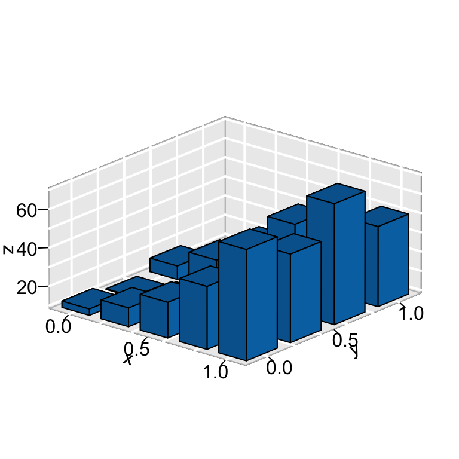
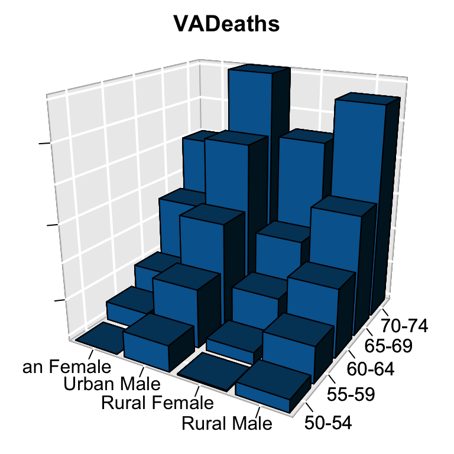

```{r setup, include=FALSE}
knitr::opts_chunk$set(echo = TRUE)

library(plotly)
library(dplyr)
```

## Wykres do poprawy
{width=700, height=700}

Na powyższym wykresie wiele słupków jest zwyczajnie niewidocznych. Ponadto brakuje tytułu oraz opisu osi. Na stronie na której go znalazłem znajduje się poniższa propozycja poprawy tej grafiki:

{width=700, height=700}

Jednakże pomimo rotacji słupków, dodanego tytułu oraz opiu osi i ta wersja jest mało czytelna. Ponadto jak widać w grafice źródłowej napisy na osiach zostały ucięte. Wobec tego zdecydowałem się na zrezygnowanie z efektu 3D poprzez rozbicie wykresu na kategorie.  

<!-- Wczytanie potrzebnych pakietów oraz danych: -->

```{r,echo=FALSE}


x <- as.data.frame(VADeaths)

data <- data.frame(age=c("50-54", "55-59", "60-64", "65-69", "70-74"), 
                   rural_male=x$`Rural Male`, 
                   rural_female=x$`Rural Female`,
                   urban_male=x$`Urban Male`,
                   urban_female=x$`Urban Female`)

```

## Poprawiony wykres


```{r pressure, echo=FALSE}
plot_ly(data=data,
        x=~age,
        y=~rural_male, 
        type="bar") %>%layout(
          title="Zgony w Virginii w 1947 roku",
          xaxis=list(title="Przedział wiekowy"),
          yaxis=list(title="Zgony na 1000 osób", range=c(0,75))
        ) %>% layout(
          updatemenus = list(
            list(
              x = 0.3, y = 1,
              buttons = list(
                list(method = "update",
                     args = list(list(y = list(data$rural_male))),
                     label = "Mężczyźni na wsiach"),
                list(method = "update",
                     args = list(list(y = list(data$rural_female))),
                     label = "Kobiety na wsiach"),
                list(method = "update",
                     args = list(list(y = list(data$urban_male))),
                     label = "Mężczyźni w miastach"),
                list(method = "update",
                     args = list(list(y = list(data$urban_female))),
                     label = "Kobiety w miastach")
              )))
        )


```

Powyższa grafika jest w pełni przejrzysta oraz zawiera wszystkie potrzebne informacje.

## Bibliografia
- http://www.sthda.com/english/wiki/impressive-package-for-3d-and-4d-graph-r-software-and-data-visualization
- wbudowana ramka danych "VADeaths"