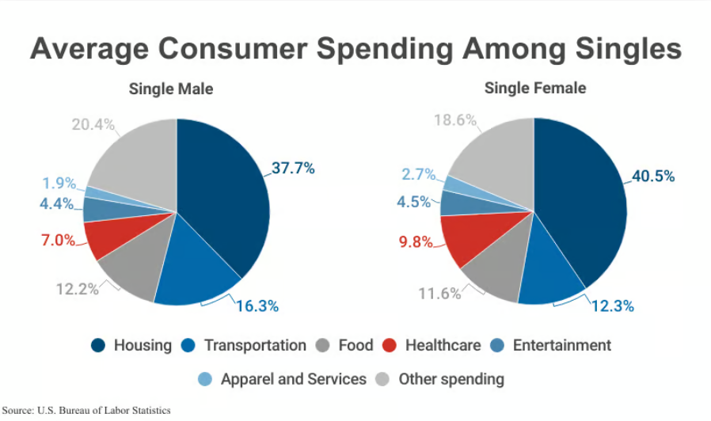

## HW5, Aleksandra Idczak



Źródło: <https://capitaloneshopping.com/research/male-vs-female-shopping-statistics/>

### Błędy w wizualizacji

Na wizualizacji są dwa wykresy kołowe, z których trudniej jest odczytać dane, a potem porównać je między płciami. Dodatkowo wykres dla mężczyzn nie sumuje się do 100%, tylko do 99.9% oraz odcienie niebieskiego mogą być trudne do rozróżnienia.

### Kod

```{r setup, include=FALSE, message=FALSE}
library(plotly)
library(dplyr)
```

```{r}
single_male <- c(37.7,16.3,12.2,7,4.4,1.9,20.4)
single_female <- c(40.5,12.3,11.6,9.8,4.5,2.7,18.6)
spendings <- c("Housing", "Transportation", "Food", "Healthcare", "Entertainment", "Apparel and Services", "Other")
data <- data.frame(spendings, single_male, single_female)
```

```{r}
xform <- list(categoryorder = "array",
              categoryarray = spendings)
fig <- plot_ly(data,
        x = ~ spendings,
        y = ~ single_female, 
        type = 'bar',
        name = 'Single female', 
        visible = TRUE,
        hovertemplate = paste('<b>Single female</b>', "<br><b>category: </b> ",data$spendings, "<br><b>percentage:</b> ", data$single_female, "%")) %>% 
  layout(xaxis = xform)

fig <- fig %>% add_trace(y = ~ single_male, 
                         name = 'Single male', 
                         visible = TRUE,
                         hovertemplate = paste('<b>Single male</b>', "<br><b>category: </b> ",data$spendings, "<br><b>percentage:</b> ", data$single_male, "%"))

fig <- fig %>% layout(yaxis = list(title = 'Count'), 
                      barmode = 'group')

fig <- fig %>% layout(
    title = "Average consumer spendings amongst singles",
    xaxis = list(title = "Category"),
    yaxis = list(title = "Percentage of total income"),
    updatemenus = list(
      list(
        x = 1.4,
        y = 0.8,
        buttons = list(
          list(
            method = "restyle",
            args = list("visible", list(TRUE,TRUE)),
            label = "Both"),
          list(
            method = "restyle",
            args = list("visible", list(TRUE,FALSE)),
            label = "Single female"),
          list(
            method = "restyle",
            args = list("visible", list(FALSE,TRUE)),
            label = "Single male")
        ))))
```

### Poprawiony wykres

```{r}
fig
```

Ten wykres słupkowy jest lepszy, ponieważ łatwo możemy odczytać dane i porównać je między kategoriami i płciami. Możemy też wybrać, aby pokazać dane dotyczące tylko kobiet lub tylko mężczyzn.
