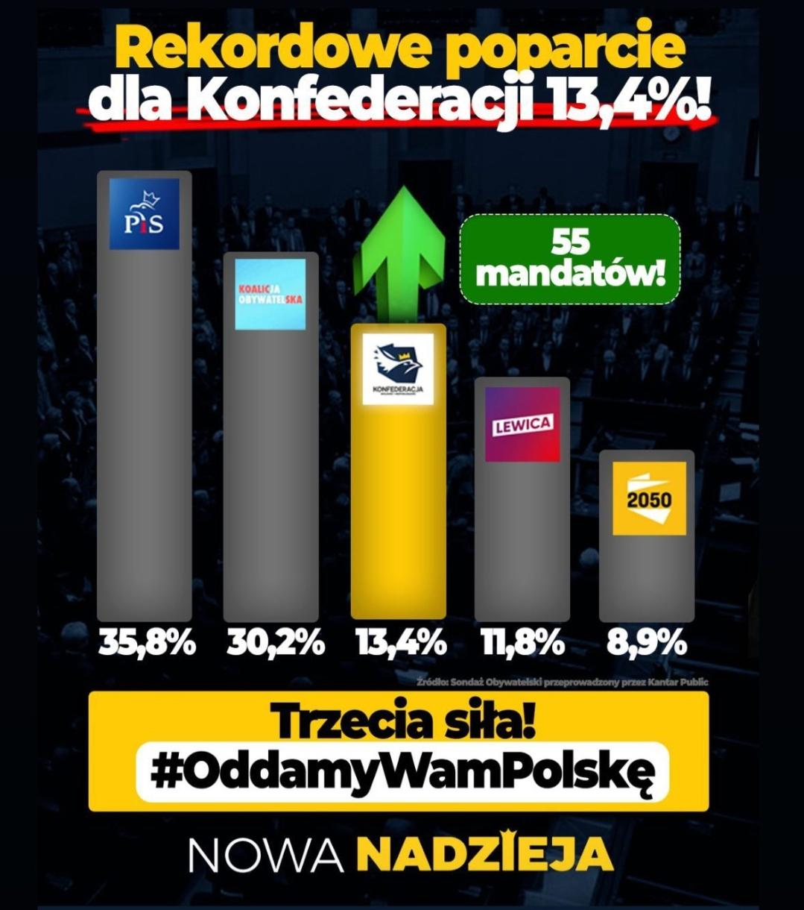

```{r setup, include=FALSE}
knitr::opts_chunk$set(echo = TRUE)
library(dplyr)
library(plotly)

```

# Temat pracy

Zajmiemy się poprawą wykresu przedstawionego podczas kampanii do wyborów parlamentarnych na stronie konfederacji:


Wykres w tej wersji znaleziono [na reddicie](https://www.reddit.com/r/Polska/comments/11x0c5d/speca_od_wykres%C3%B3w_s%C5%82upkowych_wzi%C4%99li_chyba_z_tvp/)

# Co jest nie tak?

Naruszona jest jakakolwiek skala na wykresie, oprawa graficzna mogłaby być mniej tendencyjna.

Nasza wizualizacja dodatkowo pozwoli wybrać, czy wolimy patrzeć na zwykły, standardowy, piękny Barplot, czy na wykres kołowy.
```{r rework, echo = FALSE, fig.width = 9, fig.height = 6}
pro <- c(35.8, 30.2, 13.4, 11.8, 8.9)
names <-
  c(
    "Prawo i Sprawiedliwość",
    "Koalicja Obywatelska",
    "Konfederacja",
    "Lewica",
    "Polska 2050"
  )
df <- data.frame(pro, names)
df$names <- factor(names, levels = names)
plot_ly(
  data = df,
  x = ~ names,
  y = ~ pro,
  type = "bar"
) %>% layout(
  title = "Poparcie dla ugrupowań politycznych w marcu 2023 roku",
  xaxis = list(title = "Partia Polityczna"),
  yaxis = list(title = "Poparcie w %"),
  updatemenus = list(list(
    x = 1,
    y = 1,
    buttons = list(
      list(
        method = "restyle",
        args = list("type", "bar"),
        label = "Barplot"
      ),
      list(
        method = "restyle",
        args = list("type", "pie"),
        label = "Piechart"
      )
    )
  ))
) %>%  config(displayModeBar = FALSE)
```

# Dlaczego ten wykres jest lepszy?

Po pierwsze - nie zakłamuje rzeczywistości podwyższając niektóre słupki.

Po drugie - pozbawiony jest tendencyjnej oprawy graficznej.