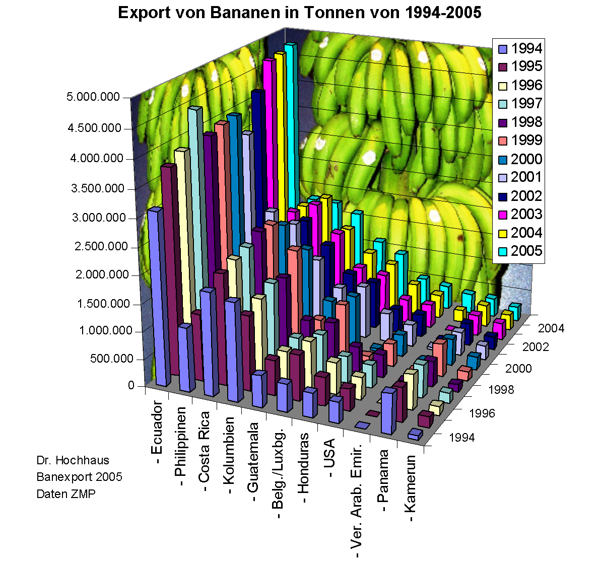

# Raport z HW5 - "Export von Banannen in Tonnen"

To jest raport z zadania domowego na Wstęp do eksploracji danych, dotyczącego poprawienia wykresu i zinteraktywowania go.

## Jaki wykres wybrałem do poprawy?

*Export von Banannen in Tonnen von 1994-2005*

Link do grafiki:

<https://clarkdatalabs.github.io/banana-project/resources/banana_graph.png>

```{r, echo=FALSE}

```

Największe wady tego wykresu (co do poprawy):

1.  **Tło wykresu** - pomijając aspekt tematyki tej analizy można było wybrać po prostu inne tło, albo... wogóle go nie wybierać. Najlepiej aby sam wykres był czytelny i to on był na pierwszym planie, a nie te zielone owoce w tle.

2.  **Wymiar wykresu** - nie chodzi tu o jego wielkość, a o wymiarowość 3D. Ciężko porównywać słupki ze sobą i mamy duży przesyt informacji. Dodatko w środkowej części wykresu jest problem z identyfikacją do jakiej kategorii należy dany słup.

Na szczęście było łatwo się dokopać do danych, z których został zrobiony ten wykres. Oto link do nich:

<https://www.fao.org/faostat/en/#data/TCL> <https://clarkdatalabs.github.io/banana-project/>

## Nowa, lepsza wizualizacja

Ze strony FAO pobrałem data frame z odpowiednimi opcjami (zaznaczyłem wszystkie kraje, eksport oraz jako przedmiot eksportowany - banany) i nazwałem go "Export bananen in tonnen".

```{r}
library(plotly)
library(dplyr)

export_bananen_in_tonen <- read.csv("Export bananen in tonnen.csv")
export_bananen_in_tonen %>% 
  filter(Value >1000) %>% 
  select(Area, Year, Value) %>%
  mutate(Area = case_when(
    Area %in% c("Belgium","Luxembourg") ~ "Belgium-Luxembourg",
    TRUE ~ Area)) %>%
  filter(Year >= 1994 & Year <= 2005,
         Area %in% c("Ecuador", "Philippines", "Costa Rica", "Columbia",
                     "Guatemala", "Belgium-Luxembourg","Honduras", "USA",
                     "United Arab Emirates", "Panama", "Cameroon"))   -> export_bananen_in_tonen
```

Wybrałem własne kolory, które mają reprezentować kraj na wykresie:

```{r}
moja_super_paleta <- c("#72F7B2", "#436BFA", "#F772EC", "#FA160B",
                       "#F7AC72", "#84FA4D", "#FAF24D", "#4DF3FA", "black")
```

Teraz można przejść do wykresu. Zdecydowałem się odejść od słupków, a raczej pokazać jakieś trendy liniowe porównując kraje na osi czasu (lata). Jakie zmiany zaszły?

1.  Wykres jest 2D oraz liniowo-punktowy z wyborem opcji, czy chcemy mieć linie, kropki czy linie i kropki.

2.  Nie dodałem tła. Tak jest po prostu czytelniej.

3.  Dodałem interakcję: jeżeli najedziemy kursorem na daną linię, to wyświetli nam się informacja o ilości ton, roku oraz kraju wraz z kolorem.

```{r}
plot_ly(
  data = export_bananen_in_tonen,
  x = ~Year,
  y = ~Value,
  color = ~Area,
  colors = moja_super_paleta,
  type = "scatter",
  mode = "lines+markers",
  hovertemplate = paste(
    "<b>Year</b>: %{x}",
    "<br><b>Value</b>: %{y} tons"
  )
) -> fig

fig %>% layout(
  title= "Export of bananas in tons",
  xaxis= list(title = "Country"),
  yaxis= list(title = "Value in tons"),
  updatemenus = list(
    list(
      y = 0.8,
      buttons = list(
        list(method = "update",
             args = list(list(type = "scatter", mode = "lines")),
             label = "Lines"),
        list(method = "update",
             args = list(list(type = "scatter", mode = "markers")),
             label = "Points"),
        list(method = "update",
             args = list(list(type = "scatter", mode = "lines+markers")),
             label = "Lines and points")
      )
    )
  )
)
```

## Dlaczego nowy wykres jest lepszy?

1.  **nie jest 3D** - da się łatwo porównać wartości dla pewnych krajów w pewnych latach. Bez konieczności patrzenia do jakiej kategorii słupek należy.

2.  **jest czytelny i przejrzysty** - widać czarno na białym co gdzie jest, do czego należy, ile wynosi, jaka jest tendencja. Nie ma bananowego tła, tylko białe, co powoduje duży kontrast między kolorami.

3.  **na liniach widać więcej niż na słupkach** - linie mają przewagę nad słupkami pod względem zaznaczania trendów. Na nowym wykresie wyraźnie widać, że Ekwador zwiększył eksport w latach 1994-2005, podczas gdy na starym ciężko dopatrzeć się takiej zależności.

4.  **nowy wykres jest interaktywny** - plotly umożliwił nam dodanie interakcji do wykresu np. możemy zmienić typ lini na linię z kropkami, bez kropek oraz na same kropki. Ponadto gdy nie wiemy ile wynosi wartość w danym punkcie, to możemy sprawdzić najeżdżając kursorem na linię. Wówczas wyświetli nam się informacja o wartości w danym punkcie roku, eksportowanych bananach oraz kraju.
