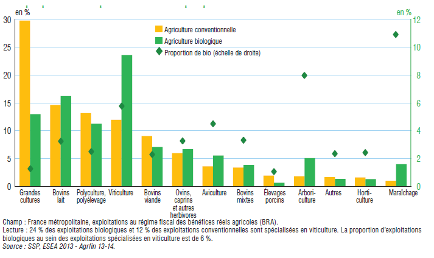

```{r setup, include=FALSE, message=FALSE}
knitr::opts_chunk$set(echo = TRUE)

# Tutaj warto wczytać biblioteki, których używamy, dodatkowo w opcjach chunk można ustawić message = FALSE.

library(dplyr)
library(plotly)

```


# Wizualizacji źródłowa
Wizualizacja pochodzi z artykułu "La politique de développement de l'agriculture biologique : une évaluation" ("Polityka rozwoju rolnictwa bio: analiza") z 29.01.2020 ze strony internetowej:  https://www.senat.fr/rap/r19-277/r19-277_mono.html



Tłumaczenie oznaczeń: żółty słupek - "Agriculture conventionelle" ("Rolnictwo konwencjonalne"), zielony słupek - "Agriculture biologique" (Rolnictwo bio"), zielony romb - "Proportion bio (echelle de droite)" ("Proporcja bio (oś z prawej)"). Na osi poziomej zostały wypisane nazwy różncyh podsektorów rolnictwa. Wykres zawiera też dwie osie pionowe oznaczone symbolem "en %" ("w %"); po prawej i lewej stronie. Ze względu na dopisek przy rombie oznaczającym „proporcje bio” wiadomo, że do tej kategorii danych odnosi się oś po prawej stronie wykresu. Stąd wniosek, że oś lewa dotyczy rolnictwa konwencjonalnego i rolnictwa bio. Zapewne kategorie: rolnictwo konwencjonalne i rolnictwo bio oznaczają wartość produkcji rolnej (€). Kategoria „proporcje bio” prawdopodobnie oznacza stosunek wartości produkcji bio do wartości produkcji konwencjonalnej (lub udział wartości produkcji bio w wartości całej produkcji rolniej: konwencjonalnej + bio) w podziale na podsektory.

# Elementy, które wymagają poprawy

Powyższy wykres, bez pogłębionej analizy, może błędnie sugerować, że w niektórych podsektorach, jak np. mleka krowiego, winogron czy owoców ("Bovins lait", "Viticulture" czy "Arboriculture") wartość produkcji bio przewyższa wartość produkcji konwencjonalnej – słupki dotyczące rolnictwa bio dla tych kategorii są wyższe niż słupki dotyczące rolnictwa konwencjonalnego. Okazuje się jednak, ze każda z kategorii: rolnictwo konwencjonalne i rolnictwo bio została potraktowana oddzielnie - po zsumowaniu wartości procentowej odpowiadającej wysokości poszczególnych słupków dla każdego typu rolnictwa oddzielnie otrzymujemy 100%. Dodatkowo analiza kolejnych danych – mniej wyraźnych (graficznie) rombów wskazuje, że proporcje wartości produkcji bio (do wartości produkcji konwencjonalnej lub całości produkcji rolnej) są stosunkowo niskie – na poziomie 1 – 11%. Prowadzi to do wniosku, że udział w wartości produkcji rolnej każdego podsektora wyliczany jest w oparciu o inna bazę: w pierwszym przypadku (słupki żółte) jest to wartość produkcji konwencjonalnej, a w drugim (słupki zielone) wartość produkcji bio. Co więcej, wartość produkcji konwencjonalnej wielokrotnie przewyższa wartość produkcji bio. Dlatego też dane dotyczące udziału poszczególnych podsektorów w wartości całości produkcji konwencjonalnej nie powinny być przedstawiane na tej samej osi co dane dotyczące poszczególnych podsektorów w wartości całości produkcji bio. 
<br>
Nie jest też do końca jasne, co zostało zaznaczone na osi po prawej (pomimo dopisku przy symbolu rombu): kolor zielony użyty do oznaczenie tej osi przypomina zielony użyty do oznaczenia słupka odnoszącego się do rolnictwa bio. Dodatkowo w przypadku jednego z podsektorów: "Viticulture" zielony romb nachodzi na zielony słupek, przez co kolory się trochę zlewają.


# Poprawiona wizualizacja

```{r warning=FALSE, message=FALSE}
library(plotly)
library(dplyr)

podsektor <- c("Zboża", "Mleko krowie", "Hodowle wielorodzajowe", "Winogrona", "Mięso wołowe", "Hodowla owiec/kóz", 
               "Hodowla drobiu", "Hodowla krów jednocześnie mięsnych i mlecznych", "Hodowla świń", "Owoce", "Inne", "Zioła", 
               "Warzywa")

udział_w_konwencjonalnym <- c(29, 14.5, 13, 12, 8.5, 6, 3.4, 3.4, 2.4, 2.4, 2, 1.9, 1.5)

udział_w_bio <- c(13, 15.5, 11, 23, 7, 7, 5.5, 4, 1, 5, 2, 2, 4)

odsetek_bio <- c(1.8, 3, 2.3, 5.9, 2.2, 3.5, 4.2, 3.8, 1, 8, 2, 2, 11)

data <- data.frame(podsektor, udział_w_konwencjonalnym, udział_w_bio, odsetek_bio)


fig <- plot_ly(data, x = ~udział_w_konwencjonalnym, y = ~udział_w_bio, type = 'scatter', mode = 'markers', color = ~odsetek_bio, colors = c("#C1E1C1", "lightgreen", "#0eff00", "#1fc600", "#19A519", "#089000", "#0a5d00","#063b00"),
               marker = list(size=20, opacity = 0.9, sizemode = 'diameter'),
               text = ~paste('Podsektor:', podsektor, '<br>Jaki procent rolnictwa w tym podsektorze jest bio:', odsetek_bio, '%'))

fig <- fig %>% layout(title = 'Rolnictwo konwencjonalne i rolnictwo bio we Francji w 2013',
                      
                      xaxis = list(title ="Udział podsektora w całości rolnictwa konwencjonalnego (w %)",
                                   titlefont = list(size = 13), showgrid = FALSE),
                      
                      yaxis = list(title ="Udział podsektora w całości rolnictwa bio (w %)", 
                                   titlefont = list(size = 13),
                                   showgrid = FALSE),
                      paper_bgcolor = 'rgb(243, 243, 243)',
                      
                      plot_bgcolor = 'rgb(243, 243, 243)') %>% 
  colorbar(title = "Udział bio w podsektorze (w %)", titlefont = list(size = 11))

fig

```

# Uzasadnienie

Na zaproponowanym przeze mnie wykresie na osi poziomej oznaczyłam udział poszczególnych podsektorów w całości produkcji konwencjonalnej, a na osi pionowej udział tych podsektorów w całości produkcji bio. Każde kółko zawiera informacje o konkretnym podsektorze (z usytuowania względem osi poziomej będzie wynikać udział danego podsektora w wartości produkcji konwencjonalnej i analogicznie z usytuowania względem osi pionowej – udział w wartości produkcji bio). Natężenie koloru zielonego wskazuje podsektory, w których wartość produkcji rolnictwa bio w odniesieniu do wartości produkcji rolnictwa konwencjonalnego (lub całości produkcji rolnej) jest wyższa. Informacje o nazwie podsektora i dokładnej wartości „proporcji bio” uzyskuje się po najechaniu na kropkę. 

