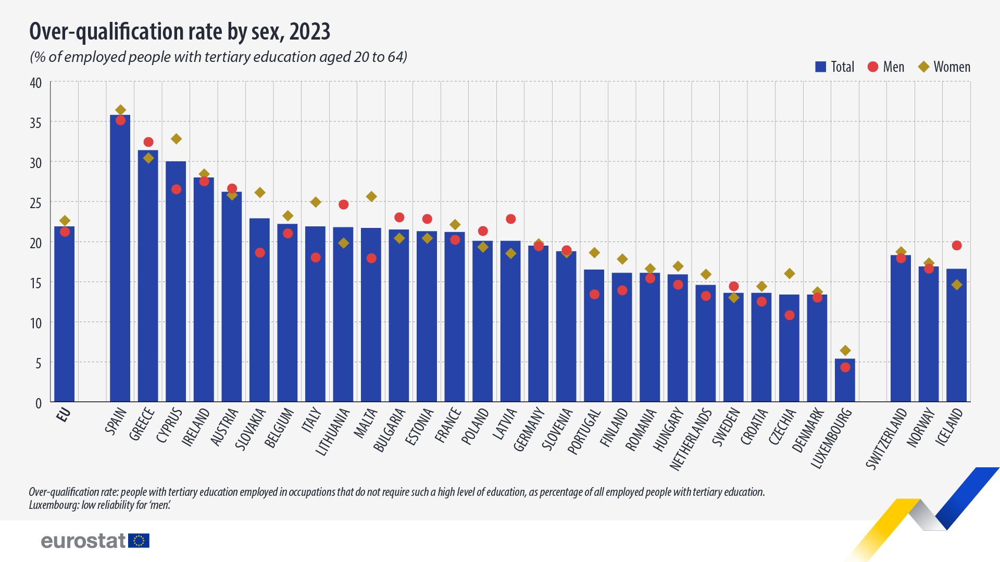

```{r setup, include=FALSE}
knitr::opts_chunk$set(echo = TRUE)

# Wczytanie bibliotek, których używamy
library(dplyr)
library(plotly)

```

# Wizualizacja źródłowa, która będzie poprawiana wraz z podaniem źródła

Wykres, który zamierzam poprawić znalazłem na profilu Europejskiego Urzędu Statystycznego na platformie Facebook. Link zawarty w poście prowadzi do artykułu:

<https://ec.europa.eu/eurostat/en/web/products-eurostat-news/w/ddn-20240425-1>

```{r echo=FALSE, out.width = "100%", fig.align = "center"}

```

# Krótkie uzasadnienie, jakie elementy wizualizacji wymagają poprawy

Wykres nie ma wiele rzeczy, które należy poprawić. Pierwszą rzeczą, która rzuca się w oczy jest obecność prostych pionowych na wykresie. W podanej postaci wykresu są one raczej zbędne. Drugą rzeczą jest przesyt informacji. Można się pogubić, jak rozkładają się wartości dla płci dla poszcególnych krajów. Trzecią i ostatnią - wprowawdzający w błąd podtytuł.

# Utworzona wizualizacja oraz kod potrzebny do jej wygenerowania

```{r}
# Wczytanie danych
dane <- read.csv("lfsa_eoqgan_linear.csv.gz")

# obróbka ramki - wyrzucenie krajów nie występujących na znalezionym wykresie
# i zawężenie danych do pożądanych
all <- dane %>% 
  filter(age == "Y20-64", TIME_PERIOD == 2023, citizen == "TOTAL") %>% 
  filter(!(geo %in% c("TR", "RS", "EA20", "BA"))) %>% 
  select(geo, sex, OBS_VALUE) %>%
  mutate(OBS_VALUE = as.numeric(OBS_VALUE)) %>% 
  arrange(desc(OBS_VALUE), desc(sex))


# pomoc w wyświetleniu przerw między odpowiednimi argumentami 
all[94,] <- list(" ", "T", 0)
all[95,] <- list("  ", "T", 0)
all[96,] <- list(" ", "M", 0)
all[97,] <- list("  ", "M", 0)
all[98,] <- list(" ", "F", 0)
all[99,] <- list("  ", "F", 0)

# nadanie odpowiednich kolejności argumentom
total <- all[all$sex == "T", ]
total <- total %>% 
  arrange(factor(geo,
                 levels = c("EU27_2020", " ", "ES", "EL", "CY", "IE", "AT", "SK",
                          "BE", "IT", "LT", "MT", "BG", "EE", "FR", "PL", "LV",
                          "DE", "SI", "PT", "FI", "RO", "HU", "NL", "SE",
                          "HR", "CZ", "DK", "LU", "  ", "CH", "NO", "IS")))

men <- all[all$sex == "M", ]
men <- men %>% 
  arrange(factor(geo,
                 levels = c("EU27_2020", " ", "ES", "EL", "CY", "IE", "AT", "SK",
                            "BE", "IT", "LT", "MT", "BG", "EE", "FR", "PL", "LV",
                            "DE", "SI", "PT", "FI", "RO", "HU", "NL", "SE",
                            "HR", "CZ", "DK", "LU", "  ", "CH", "NO", "IS")))
women <- all[all$sex == "F", ]
women <- women %>% 
  arrange(factor(geo,
                 levels = c("EU27_2020", " ", "ES", "EL", "CY", "IE", "AT", "SK",
                            "BE", "IT", "LT", "MT", "BG", "EE", "FR", "PL", "LV",
                            "DE", "SI", "PT", "FI", "RO", "HU", "NL", "SE",
                            "HR", "CZ", "DK", "LU", "  ", "CH", "NO", "IS")))

 # rozszerzenie skrótów państw członkowskich UE 
total$geo <- list("EU", " ", "SPAIN", "GREECE", "CYPRUS", "IRELAND",
                  "AUSTRIA", "SLOVAKIA", "BELGIUM", "ITALY", "LITHUANIA",
                  "MALTA", "BULGARIA", "ESTONIA", "FRANCE", "POLAND",
                  "LATVIA", "GERMANY", "SLOVENIA", "PORTUGAL", "FINLAND",
                  "ROMANIA", "HUNGARY", "NETHERLANDS", "SWEDEN", "CROATIA",
                  "CZECHIA", "DENMARK", "LUXEMBOURG", "  ", "SWITZERLAND",
                  "NORWAY", "ICELAND")

men$geo <- total$geo
women$geo <- total$geo

# utworzenie zmiennej, która będzie służyła za tytuł wykresu
title <- paste0("<b>Over-qualification rate by sex, 2023</b><br><sub>",
                "% of over-qualified people aged 20 to 64",
                " with tertiary education, relative to all",
                " people with tertiary education",
                "</sub>")
```


```{r fig.height=5, fig.width=11.5, message=FALSE, warning=FALSE}

# Wyświetlenie wykresu
plot_ly() %>% 
  add_trace(x = total$geo,
            y = total$OBS_VALUE,
            type = "bar", visible = T,
            marker = list(color = "rgb(62, 79, 189)"),
            name = "Total") %>% 
  add_trace(x = men$geo,
            y = men$OBS_VALUE,
            type = "scatter",
            mode = "markers", visible = T,
            marker = list(color = "red",
                          size = 10*(men$OBS_VALUE>0),
                          symbol = "circle"),
            name = "Men") %>% 
  add_trace(x = women$geo,
            y = women$OBS_VALUE,
            type = "scatter",
            mode = "markers", visible = T,
            marker = list(color = "orange",
                          size = 10*(women$OBS_VALUE>0),
                          symbol = "diamond"),
            name = "Women") %>%
  layout(title = list(text = title,
                      x = 0.03,
                      y = 0.95,
                      font = list(size = 20,
                                  family = "Arial")),
         hovermode = 'x',
         margin = list(l=100, r=20, t=100, b=40),
         xaxis = list(tickangle = 300,
                      categoryorder = "trace"),
         yaxis = list(range = c(0,40)),
         updatemenus = list(
           list(
           buttons = list(
             list(method = "restyle",
                  args = list("visible", list(TRUE, TRUE, TRUE)),
                  label = "All"),
             list(method = "restyle",
                args = list("visible", list(TRUE, FALSE, FALSE)),
                label = "Total"),
             list(method = "restyle",
                  args = list("visible", list(FALSE, TRUE, FALSE)),
                  label = "Men"),
             list(method = "restyle",
                  args = list("visible", list(FALSE, FALSE, TRUE)),
                  label = "Women"),
             list(method = "restyle",
                  args = list("visible", list(FALSE, TRUE, TRUE)),
                  label = "Men & Women")
                        )
             )
         ))
```

# Krótkie uzasadnienie, dlaczego przygotowany wykres jest lepszy od oryginalnego

<div align="justify">Pozbyłem się pionowych linii, co na wizualizacji z wykresem słupkowym poprawiło przejrzystość. Z kolei na tych z wykresami punktowymi istnieje opcja najechania na punkty i z nich odczytać wartość i państwo. Umożliwia to na pewniejsze i szybsze zrozumienie na co się patrzy - nie trzeba błądzić wzrokiem w górę i w dół. Następnie, interaktywność polegająca na możliwości wyboru wyświetlanych wykresów również pozytywnie wpływa na odbiór. Zmieniłem też podtytuł. Wydaje mi się, że obecniej łatwiej zrozumieć o co w nim chodzi. Przede wszystkim wytłumaczenie, czym jest odsetek osób o nadmiernych kwalifikacjach, nie jest ukryte na dole, co jest wybitnie łatwo przegapić.

Ciekawostka. Szwajcaria, Norwegia i Islandia, mimo iż nie są w Unii Europejskiej (liczy ona na tę chwilę 27 państw człownkowskich) znajdują się na wykresie, bo Norwegia i Islandia należą do Europejskiego Obszaru Gospodarczego, a Szwajcaria jest państwem stowarzyszonym z UE. Więc twórca wykresu uznał je za ważne i specjalnie odseparował od reszty.</div>