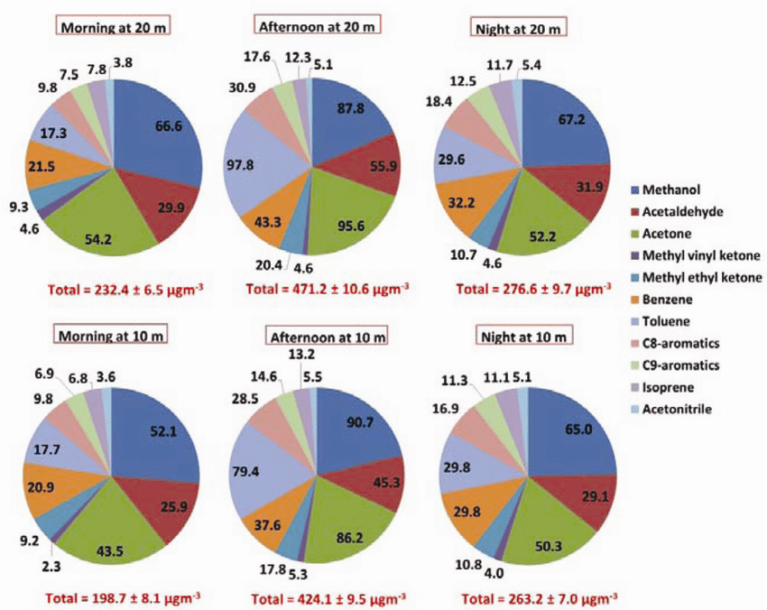

# Praca domowa 5

```{r setup, include=FALSE}
knitr::opts_chunk$set(echo = TRUE)
```

```{r include=FALSE}
library(readxl)
library(dplyr)
library(plotly)
```

Rozważymy wykres przedstawiający chemiczne składniki powietrza na podstawie próbek z lotniska Indiry Gandhi od 19-go stycznia 2016 roku. Skorzystamy w tym celu z artykułu <https://www.researchgate.net/publication/314118438_Winter_Fog_Experiment_Over_the_Indo-Gangetic_Plains_of_India>.



Wiemy, że wykresy kołowe nie są najbardziej skutecznym przedstawieniem danych, gdyż trudno jest wzrokowo porównać pola wycinków koła. Oprócz tego, różne próbki powietrza mają różną masę, więc wygodniej byłoby porównywać względne wartości masy składników zamiast bezwzględnych. W celu ułatwienia zrozumienia wykresu dodamy również możliwość wyboru wysokości, na której został przeprowadzony pomiar.

```{r include=FALSE}
# Przygotowywanie danych
# Ramkę danych można zobaczyć na stronie https://docs.google.com/spreadsheets/d/1_0-HAzm1e-zzB9IXubwMNmlaryqDWmzkRY8f4iRnHJc/edit#gid=0
air <- read_excel("air.xlsx")
air <- air %>% 
  group_by(Time, Height) %>%
  mutate(Percentage = Mass/sum(Mass)*100) 
air$Time <- factor(air$Time, levels = c("Morning", "Afternoon", "Night"))
```

Poprawiona wizualizacja wygląda następująco:

```{r fig.height=6, fig.width=10, message=FALSE, warning=FALSE, echo=FALSE}
# Końcowa wizualizacja
plot_ly(type = "bar") %>% 
  add_bars(data = air %>% filter(Height == "10 m"), x = ~Compound, 
           y = ~Percentage, color = ~Time, hoverinfo = "x+y+text") %>% 
  add_bars(data =  air %>% filter(Height == "20 m"), x = ~Compound, 
           y = ~Percentage, color = ~Time, hoverinfo = "x+y+text", visible = F) %>% 
  layout(
    title = "Air compounds from samples collected at IGI Airport on 19 January 2016",
    xaxis = list(title = "Compound"),
    yaxis = list(range = list(0, 30)),
    legend = list(
      x = 0.825, y = 0.8, 
      title = list(text = "Time of day"),
      bordercolor = "lightgrey",
      borderwidth = 1.5),
    updatemenus = list(
      list(
        type = "dropdown",
        x = 1, y = 0.95,
        active = 0,
        buttons = list(
          list(method = "restyle",
               args = list("visible", list(T, T, T, F, F, F)),
               label = "Height: 10 m"),
          list(method = "restyle",
               args = list("visible", list(T, F, F, F, T, T)),
               label = "Height: 20 m")
        )
      )
    )
  )

```

Powyższa wizualizacja pozwala łatwo porównać względne wartości masy różnych składników powietrza o różnych porach dnia. Ponadto można wybrać wysokość, na której został przeprowadzony pomiar. Z tych powodów powyższy wykres jest bardziej czytelny niż początkowy.
