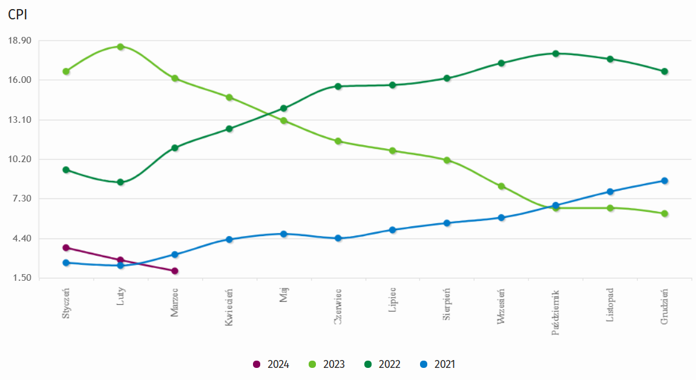

```{r setup, include=FALSE, message=FALSE}
knitr::opts_chunk$set(echo = TRUE)

library(plotly)
library(dplyr)
```

# Źródło

Wizualizacja źródłowa oraz dane dostępne są na stronie GUS: 
<https://stat.gov.pl/wykres/1.html>, stan na 7 maja 2024.

```{r pressure, echo=FALSE, out.width = '80%'}

```

*Uwaga: Wykres na stronie jest interaktywny, nie ten.*

# Elementy do poprawy

Brakuje tytułów osi i wykresu. Fajnie by było jakby się dało poszczególne lata
włączać i wyłączać.

# Wizualizacja

```{r message=FALSE, warning=FALSE}
inflacja <- read.csv("inflacja.csv")
colnames(inflacja) <- c("Miesiąc", "r2021", "r2022", "r2023", "r2024")

plot_ly(
  data = inflacja,
  x = ~Miesiąc,
  y = ~r2021,
  type = "scatter",
  name = "2021",
  mode = "lines+markers",
  marker = list(size = 10, color = '00ccff'),
  line = list(color = '00ccff')
) %>%
  add_trace(y = ~r2022,
            name = "2022",
            marker = list(size = 10, color = 'forestgreen'),
            line = list(color = 'forestgreen')) %>%
  add_trace(y = ~r2023,
            name = "2023",
            marker = list(size = 10, color = '66ff33'),
            line = list(color = '66ff33')) %>%
  add_trace(y = ~r2024,
            name = "2024",
            marker = list(size = 10, color = '660033'),
            line = list(color = '660033')) %>%
  layout(xaxis = list(showgrid = FALSE,
                      categoryorder = "array",
                      categoryarray = c("Styczeń","Luty","Marzec","Kwiecień","Maj",
                                        "Czerwiec","Lipiec","Sierpień","Wrzesień",
                                        "Październik","Listopad","Grudzień")),
         yaxis = list(title = "Inflacja w %"),
         legend = list(x = 100, y = 0.5),
         title = "Inflacja w Polsce w latach 2021 - 2024")
```

# Uzasadnienie

Elementy wymienione wcześniej zostały poprawione, przez co wykres wydaje mi się
czytelniejszy. Efekt uboczny: po najechaniu na punkt na wykresie, informacja,
która się wyświetla w plotly, np: **(Kwiecień, 4.3) 2021**, wygląda moim zdaniem
lepiej niż ta ze strony GUSu (ramka z zestawieniem wszystkich lat).