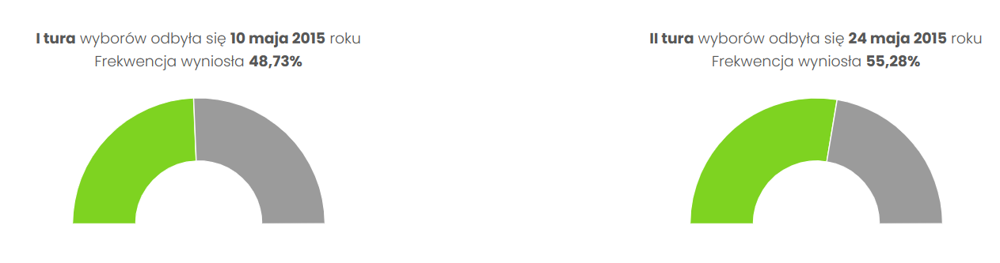

```{=html}
<style>
  body {
    font-family: 'Times New Roman', sans-serif;
     font-size: 16px;
  }
</style>
```
```{r setup, include=FALSE}
knitr::opts_chunk$set(echo = TRUE, warning = FALSE)

library(plotly)
library(forcats)
```

*Ewelina Preś*

## Źródło

Link do strony z wykresem:

<https://www.geoportalwyborczy.pl/wybory-prezydenckie-2015-wyniki-szczeg%C3%B3%C5%82owe>

Będę poprawiała wykresy frekwencji wyborczej znajdujące się na górze strony (poniżej zrzut ekranu).

 Są one interaktywne, ale ich interaktywność polega wyłącznie na podświetlaniu wycinka pierścienia, na który się najedzie. W zasadzie wykresy te są niepotrzebne. Aby wynieść z nich jakąkolwiek informację, trzeba przeczytać opisy znajdujące się nad nimi. Nawet z wiedzą, że wykresy dotyczą frekwencji w wyborach, ciężko jest oszacować kąty na wykresie pierścieniowym, szczególnie gdy różnice w wartościach są niewielkie. Brakuje podpisów i trzeba zdać się na intuicje, że kolor zielony to osoby, które wzięły udział w wyborach, a szary to te, które nie wzięły udziału.

## Moja propozycja wizualizacji

```{r plotly}
categories <- c('tak', 'nie')
values1 <- c(48.73, 51.27)
values2 <- c(55.28, 44.72)

plot_ly(x = ~fct_relevel(categories, categories), y = ~values1, type = 'bar', name = "", hovertemplate = "Udział w wyborach: %{x}<br>Odsetek Polaków: %{y}%", text = paste0(values1, "%"), textposition = "outside", textfont = list(size = 14)) %>%
  layout(title = "Frekwencja w wyborach prezydenckich w 2015",
         xaxis = list(title = 'Udział w wyborach'),
         yaxis = list(title = 'Odsetek Polaków [%]'),
         margin = list(l = 80, r = 80, b = 120, t = 50),
         height = 500, width = 500,
updatemenus = list(
  list(
    y = 0.9,
    x = 1.25,
    buttons = list(
      list(method = "restyle",
           args = list(list(y = list(values1), text = list(paste0(values1, "%")))),
           label = "Tura 1"),
      list(method = "restyle",
           args = list(list(y = list(values2), text = list(paste0(values2, "%")))),
           label = "Tura 2")
    )
  )
)
  )

```

Myślę, że mój wykres jest lepszy, bo jest opisany - wiadomo czego dotyczą dane. Oprócz tego na moim wykresie interaktywność ma większy sens - najechanie na słupek kompresuje informacje zawarte na wykresie do krótkiej notatki. Dodałam też rozwijane menu, w którym można wybrać turę wyborów. Oprócz tego łatwiej jest porównać jaka była różnica w ilości osób, między tymi, które wzięły udział w wyborach, a tymi, które nie wzięły udziału.

\
