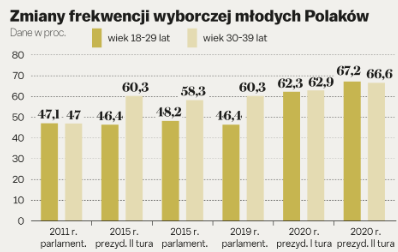

## 1. Wizualizacja źródłowa

Wizualizacja źródłowa pochodzi z artykułu ze strony wyborcza.pl: <br>
<https://wyborcza.pl/7,75968,26491854,analiza-socjologa-mlodziez-sie-przebudzila-ale-ten-bunt-moze.html>

```{r echo=FALSE}

```

Słupki na wykresie są w podobnych kolorach, dodatkowo jeden z nich zlewa się nieco z tłem. Są rozróżnialne, jednak na pierwszy rzut oka cięzko jest stwierdzić, czy np. dla danej grupy wiekowej nastąpił wzrost, czy spadek frekwencji.

## 2. Poprawiona wizualizacja

```{r przygotowanie, echo = TRUE, include= FALSE}
library(plotly)
library(dplyr)
wybory <- c('2011r. parlament', '2015r. prezyd. II tura', '2015r. parlament.', '2019r. parlament.', '2020r. prezyd. I tura', '2020r. prezyd. II tura')
od18do29 <- c(47.1, 46.4, 48.2, 46.4, 62.3, 67.2)
od30do39 <- c(47.0, 60.3, 58.3, 60.3, 62.9, 66.6)
dane <- data.frame(wybory, od18do29, od30do39)

wykres <- plot_ly(dane, x = ~wybory, y = ~od18do29, type = 'bar', name = 'Wiek 18-29 lat',
                marker = list(color = 'navyblue'),
                hoverinfo = "y") %>% 
  add_trace(y = ~od30do39, type = 'bar',
            name = 'Wiek 30-39 lat',
            marker = list(color = 'lightgreen')) %>% 
  layout(title = 
           '<b>Frekwencja wyborcza młodych Polaków</b>',
         xaxis = list(title = "Wybory", tickfont = list(size = 13), titlefont = list(size = 18), tickangle = 10, tickvals = c(-0.5, 0.5, 1.5, 2.5, 3.5 ,4.5)),
         yaxis = list(title = list(text = 'Frekwencja (%)'),
                      tickfont = list(size = 13),
                      titlefont = list(size = 18)),
         barmode = 'group', bargroupgap = 0.1, bargap = 0.3)
```


```{r, echo = FALSE, message = FALSE, warning = FALSE, fig.height= 6, fig.width= 9}
wykres
```

Utworzona wizualizacja jest lepsza od źródłowej, ponieważ pozwala szybko i jednoznacznie wychwycić jak dla konkretnej grupy wiekowej zmieniała się frekwencja w wyborach. Na nowo utworzonym wykresie możemy zobaczyć frekwencję dla jednej, konkretnej grupy wiekowej (zaznaczając ją na legendzie) lub dla obu naraz. Daje nam to możliwość łatwiejszego wyciągania z wykresu informacji, które nas interesują. Jeżeli interesują nas konkretne wartości wystarczy najechać na konkretny słupek. Ponadto kolory nie są już do siebie zbliżone oraz żaden z nich nie zlewa się z tłem wykresu. 
