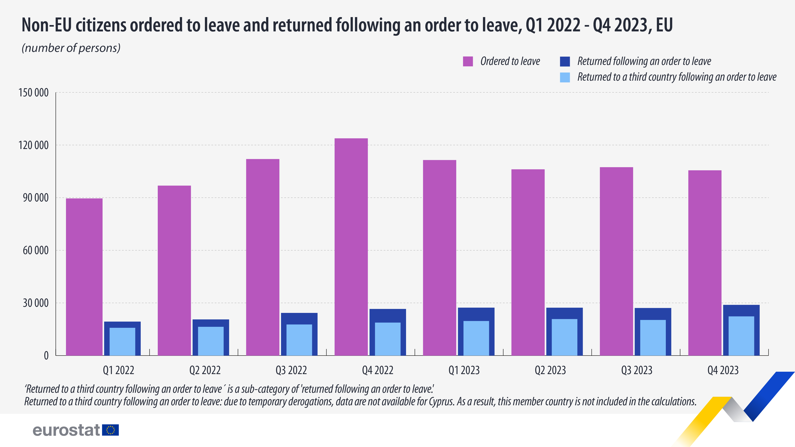

```{r setup, include = FALSE, message = FALSE}
knitr::opts_chunk$set(echo = TRUE)
library(dplyr)
library(plotly)
```

## 1. Wizualizacja do poprawy

Wizualizacja ukazała się na portalu eurostat w artykule opublikowanym 21 marca 2024 roku.
Link do artykułu:
<https://ec.europa.eu/eurostat/en/web/products-eurostat-news/w/ddn-20240321-1>

```{r echo=FALSE, fig.align = "center"}

```


Zasadniczym problemem powyższej wizualizacji jest to, że jedna z kategorii osiąga
kilkukrotnie większe wartości od dwóch pozostałych. Przez to ciężko jest zauważyć
różnicę w wysokości niebieskich i błękitnych słupków dla różnych okresów czasowych.

Rozwiązaniem poprawiającym czytelność tego wykresu jest wprowadzenie do niego interaktywności.
Do tego celu wykorzystałem pakiet plotly.

## 2. Kod 

Dokładne wartości przypisane do danych słupków sprawdziłem wchodząc w źródło danych
w zamieszczonym powyżej artykule.
```{r}
time <- c('2022-Q1', '2022-Q2', '2022-Q3', '2022-Q4', '2023-Q1', '2023-Q2', '2023-Q3', '2023-Q4')
d1 <- c(89560, 96870, 112020, 123805, 111450, 106160, 107365, 105585)
d2 <- c(19365, 20590, 24300, 26685, 27435, 27390, 27235, 28900)
d3 <- c(15820, 16385, 17700, 18855, 19780, 20890, 20385, 22315)
df <-data.frame(time, d1, d2, d3)
```

```{r}
plot <- plot_ly(df, x = ~time, y = ~d1, type = 'bar', name = 'Ordered to leave',
                marker = list(color = 'rgb(127,0,255)'),
                hoverinfo = "y") %>% 
        add_trace(y = ~d2, type = 'bar',
                  name = 'Returned following an order to leave',
                  marker = list(color = 'rgb(0,0,204)')) %>% 
        add_trace(y = ~d3, type = 'bar',
                  name = 'Returned to a third country following an order to leave',
                  marker = list(color = 'rgb(102, 178, 255)')) %>% 
        layout(title = 
                 '<b>Non-EU citizens ordered to leave and returned following an order to leave</b>',
               xaxis = list(title = "", tickfont = list(size = 12)),
               yaxis = list(title = list(text = 'Number of persons', standoff = 5),
                            titlefont = list(size = 14),
                            tickfont = list(size = 12),
                            tickformat = '.f'),
               barmode = 'group', bargap = 0.3, bargroupgap = 0.15,
               legend = list(orientation = 'h'),
               paper_bgcolor = 'rgb(245, 245, 245)',
               plot_bgcolor = 'rgb(245, 245, 245)',
               hoverlabel = list(bgcolor = 'white'))
```

## 3. Poprawiona wizualizacja


```{r, echo = FALSE, message = FALSE, warning = FALSE, fig.width= 8, fig.height= 6}
plot
```

Wizualizacja jest lepsza, ponieważ możemy zaznaczyć w legendzie, którą kategorię chcemy wyświetlać
na wykresie. Możemy na przykład wyłączyć wyświetlanie fioletowych słupków i wtedy skala na osi Y
dostosuje się do wysokości pozostałych słupków, dzięki czemu będziemy mogli łatwiej zaobserwować
różnicę ich wysokosći. Dodatkowo po najechaniu na słupek wyświetlana jest jego wartość.
