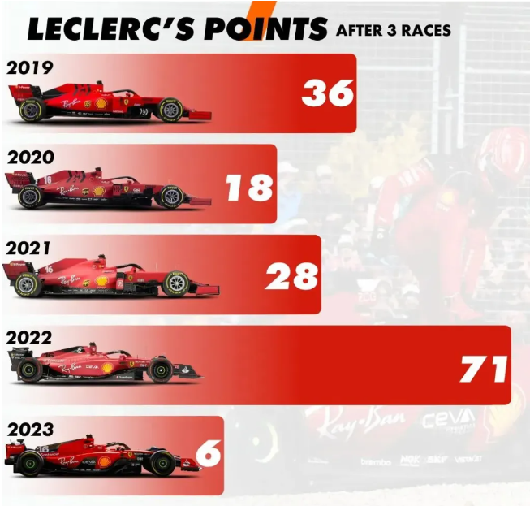

```{r setup, include=FALSE, message=FALSE}
knitr::opts_chunk$set(echo = TRUE)

library(dplyr)
library(plotly)

```

# Raport z pracy domowej nr. 5

## Wizualizacja źródłowa

 Źródło: <https://www.codeconquest.com/blog/12-bad-data-visualization-examples-explained/>

### Elementy wymagające poprawy

Wybrana przeze mnie wizualizacja jest zdecydowanie błędnie wykonana. Słupki są kompletnie nieproporcjonalne przez co zaburzają harmonię wykresu, wartości 36 i 18 wyglądają podobnie, a ten pierwszy powinien być 2 razy dłuższy. Estetyka wykresu nie wymaga poprawy, jednakże zmieniłem ją na nieco prostszą, a przez to czytelniejszą.

##Mój kod oraz utworzona wizualizacja

```{r}
raw_data <-
  data.frame(Year = c(2019, 2020, 2021, 2022, 2023),
             Points = c(36, 18, 28, 71, 6))

plot_ly(
  data = raw_data,
  x = ~ Year,
  y = ~ Points,
  type = "bar",
  marker = list(color = 'rgba(255, 0, 0, 0.72)'),
  hoverinfo = "y"
) %>% layout(
  title = list(text = "Leclerc's points after 3 races", font = list(size = 20), y = 0.98),
  xaxis = list(
    title = "Year",
    titlefont = list(size = 16),
    tickfont = list(size = 14)
  ),
  yaxis = list(
    range = c(0,75),
    title = 'Points',
    titlefont = list(size = 16),
    tickfont = list(size = 14)
  )
)
```

## Uzasadnienie

Na moim wykresie słupki są już proporcjonalne do siebie, przez co wizualizacja jest łatwiejsza do interpretacji dla czytelnika. Dodatkowo dodałem jej interaktywności, przez co dokładna liczba punktów w danym roku nie musi być umieszczona na wykresie, a jest widoczna po najechaniu na interesujący nas rok.
