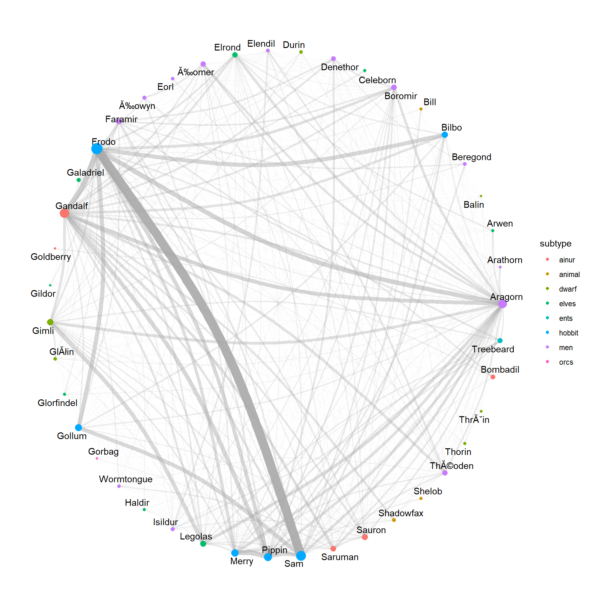
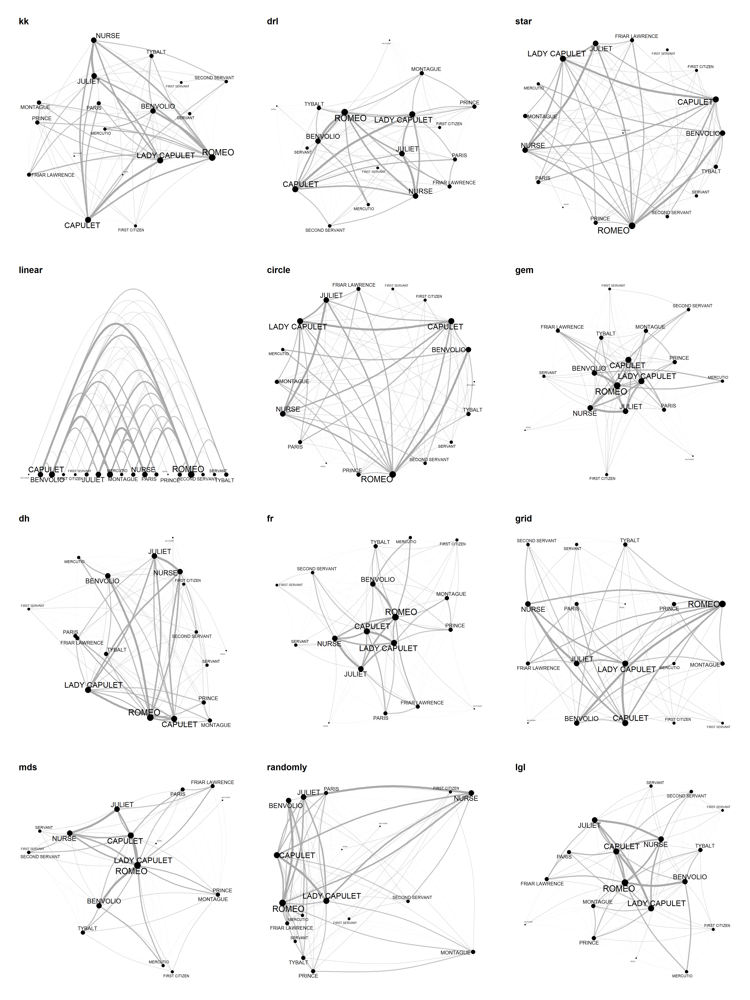
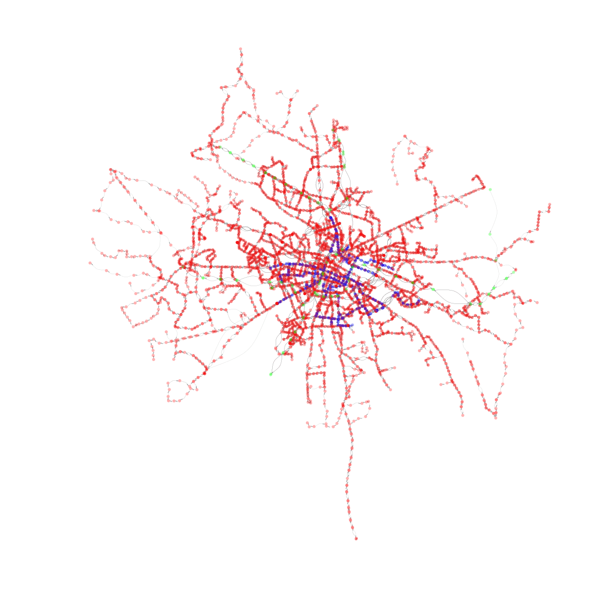
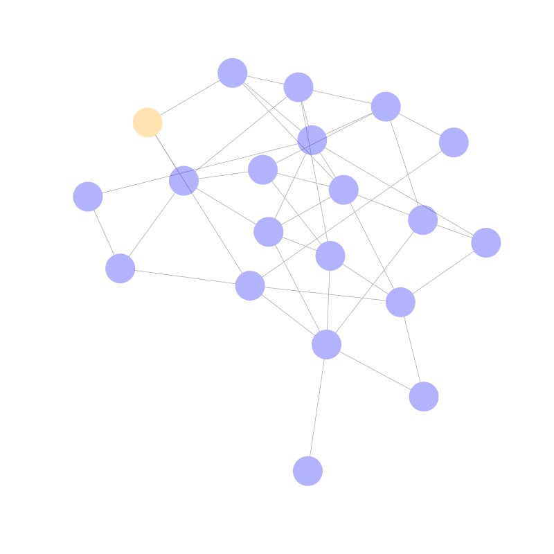
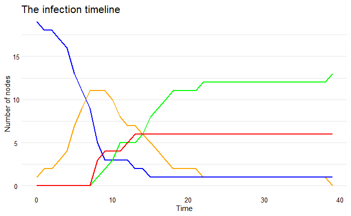

# Lab 8 Wizualizacja grafów

Niniejszy notatnik powstał w ramach przedmiotu Wstęp do Eksploracji Danych, aby przybliżyć studentom sposoby wizualizacji grafów.

# Biblioteki

```{r message=FALSE}
install.packages('tidygraph')
install.packages('ggraph')
```

```{r message=FALSE}
library(igraph)
library(tidygraph)
library(ggraph)
```

# Teoria grafów

## Definicja grafu / sieci

Grafem nazwiemy parę $V, E$ - zbiór wierzchołków $V$ (vertices/nodes) oraz krawędzi $E$ (edges). W przypadku ich tworzenia oraz wizualizacji najważniejsze są właśnie krawędzie, gdyż nawet nie mając zbioru wierzchołków jesteśmy w stanie wygenerować go na podstawie zbioru krawędzi.

Za pomocą grafów możemy reprezentować wiele zjawisk, które bazują na relacjach między poszczególnymi obiektami.

## Rodzaje grafów

1.  **Grafy proste** - krawędzie są niezorientowane, bez wag, istnieje tylko jedna warstwa, itd,

2.  **Grafy skierowane** - krawędzie mają kierunek, np. istnieje krawędź z $A$ do $B$, ale z $B$ do $A$ już nie,

3.  **Multigrafy** - dopuszczamy aby dwa wierzchołki łączyłą więcej niż jedna krawędź oraz pętle z $A$ do $A$,

4.  **Grafy ważone** - każda krawędź ma przyporządkowaną wagę, co potem wpływa na interpretację sieci,

5.  **Grafy warstwowe** - krawędzie należą do różnych warstw grafu, pomimo że zbió wierzchołków jest stały,

6.  **Hipergrafy** - najbardziej skomplikowane struktury zezwalające na nie-binarne relacje.

W trakcie laboratorium (a także w praktyce) najczęściej spotykamy się z grafami i kombinacjami z punktów 1-4.

## Ważne pojęcia

1.  **Macierz sąsiedztwa** - Macierz $A$ o wymiarach $N x N$ dla grafu o $N$ wierzchołkach, gdzie $a_{ij}$ to siła krawędzi z $i$ do $j$.

2.  **Stopień wierzchołka** - Liczba krawędzi wychodzących z wierzchołka (grafy nieskierowane). Dla skierowanych mamy stopień wierchołka wchodzący (in) oraz wychodzący (out) i nie muszą być równe.

3.  **Ścieżka w grafie** - Ścieżką między $A$ i $B$ nazwiemy zbiór krawędzi, który wspólnie łączą wierzchołki $A$ i $B$.

4.  **Dystans** - Dystansem między $A$ i $B$; $d(A,B)$ nawiemy najkrótszą ścieżkę między $A$ i $B$.

5.  **Spójność grafu** - graf jest spójny gdy z każdego wierzchołka istnieje ścieżka do każdego innego.

## Sieci rzeczywsite (real networks)

W ramach laboratorium zajmować będziemy się jedynie sieciami rzeczywistymi, jako że są to struktury najczęściej występujące w naturze. Aby rozpoznać czy mamy do czynienia z taką siecią należy dokonać prostej analizy grafu i odpowiedzieć na następujące pytania:

1.  Czy rozkład stopni wierzchołków ma gruby ogon?
2.  Czy mamy do czynienia ze zjawiskiem małego świata (średnica grafu mniejsza niż 6)? (small-world phenomenon)
3.  Czy krawęzie są silnie skorelowane? (clustering coefficient)

Jeśli na część z nich odpowiemy 'Tak' oznacza to że prawdopodbnie mamy do czynienia z siecią rzeczywistą.

# W jaki sposób można reprezentować grafy?

Istnieje wiele sposobów na przechowywanie struktur grafowych. Bardziej zaawansowane metody wykorzystują formaty takie jak np. gml, i trzymają wszystkie infromacje w jednym pliku.

```{r}
?read.graph
```

```{r}
dolphins_graph <- read_graph("data/dolphins.gml", format = "gml")
dolphins_graph
```

Inne podejścia są natomiast bardziej prymitywne i wykorzystują formaty takie jak csv, aby w dwóch osobnych plikać trzymać informacje o wierzchołkach oraz krawędziach. W takich strukturach często zauważyć można dodatkowe informacje, takie jak np. waga krawędzi, albo dodatkowe cechy wierzchołków.

```{r}
LOTR_edges <- read.csv('data/LOTR-edges.csv')
LOTR_nodes <- read.csv('data/LOTR-nodes.csv', sep = '\t')
View(LOTR_edges)
View(LOTR_nodes)
```

W niektórych przypadkach, sieci (networks - inna nazwa na grafy) mogą być reprezentowane poprzez bardzo proste struktury, opisujące jedynie zbiór krawędzi.

```{r}
Erdos_edges <- read.csv('data/ca-Erdos992.csv', sep = ' ', header = FALSE)
head(Erdos_edges)
```

W przypadku danych rzeczywistych, najczęsciej spotkać można bardzo rozbudowane struktury, często zapisywane w formacie JSON, będące nieuporządkowanymi plikami ogromnych rozmiarów. Jako, że mamy tylko jedne laboratoria o grafach to skupimy się jedynie na wizualizacji dość prostych obiektów.

# Wizualizacja grafów

## Igraph

igraph jest jednym z najpopularniejszych narzędzi służących do analizy grafów. Poza samą wizualizacją sieci, jest on przede szystkim zorientowany na ich analizę, oraz generowanie.

### Dolphins

```{r}
?igraph.plotting
?layout
```

```{r fig.height=8, fig.width=16}
plot.igraph(dolphins_graph)
```

```{r fig.height=8, fig.width=16}
plot.igraph(dolphins_graph) # Przechodzimy parametr po parametrze tłumacząc co robi co aż dojdziemy do grafu poniżej korzystając z dokumentacji igraph plotting
```

```{r fig.height=8, fig.width=16}
plot.igraph(dolphins_graph,
            vertex.size = 14,
            vertex.color = 'lightgreen',
            vertex.frame.color = 'darkgreen',
            vertex.frame.width = 2,
            vertex.shape = 'rectangle',
            vertex.size2 = 7,
            vertex.label.cex = 1,
            vertex.label.color = 'black',
            vertex.label.dist = 0,
            edge.color = 'darkgrey',
            edge.width = 2,
            edge.arrow.size = 2,
            edge.lty = 3,
            edge.curved = TRUE, 
            layout = layout_with_graphopt,
            margin = 0,
            rescale = TRUE,
            asp = 0.5,
            frame = FALSE,
            main = 'Dolphins community network',
            sub = 'representing the interaction between individuals from the same group')
```

### Zachary's karate club

Zadanie 1: analogicznie do zbioru dolphins, poprawcie graf przedstawiający relacje między członkami klubu Zacharego, tak aby wizualizacja była czytelniejsza.

```{r}
karate <- read_graph("data/karate.gml", format = "gml")
```

```{r fig.height=5, fig.width=10}
plot.igraph(karate)
```

```{r fig.height=5, fig.width=10}
plot.igraph(karate,
            vertex.size = 10,
            vertex.color = 'lightblue',
            vertex.frame.color = 'blue',
            vertex.frame.width = 1,
            vertex.shape = 'circle',
            vertex.size2 = 7,
            vertex.label.cex = 1,
            vertex.label.color = 'darkblue',
            vertex.label.dist = 0,
            edge.color = 'darkgrey',
            edge.width = 2,
            edge.arrow.size = 2,
            edge.lty = 1,
            edge.curved = FALSE, 
            layout = layout_nicely,
            margin = 0,
            rescale = TRUE,
            asp = 0.5,
            frame = FALSE,
            main = 'Zacharys club')
```

## GGraph

Alternatywą do wizualizacji grafów za pomocą biblioteki igraph jest inspirowany ggplotem, pakiet ggraph. Jest on zorientowany jedynie w kierunku wizualizacji i zasadniczo oferuje więcej możliwości niż sam igraph, jednak jest też trochę bardziej skomplikowany.

### Dolphins

#### Wizualizacja

```{r}
tg <- tidygraph::as_tbl_graph(dolphins_graph) %>% 
  tidygraph::activate(nodes)
tg
```

```{r}
edge_list <- tg %>%
  activate(edges) %>%
  data.frame()

node_list <- tg %>%
  activate(nodes) %>%
  data.frame()

node_list$degree <- rep(0, nrow(node_list))
node_list$id <- node_list$id + 1

for (i in 1:nrow(node_list)) {
  node_list$degree[i] <- sum(edge_list$from == node_list$id[i]) + sum(edge_list$to == node_list$id[i])
}
head(edge_list)
head(node_list)
```

```{r}
ig <- igraph::graph_from_data_frame(d = edge_list, vertices = node_list, directed = FALSE)
```

```{r fig.height=8, fig.width=16, message=FALSE, warning=FALSE}
ig %>%
  ggraph(layout = "auto") +
  geom_node_point() +
  geom_edge_link() +
  geom_node_text(aes(label = label))

```

```{r fig.height=8, fig.width=16, message=FALSE, warning=FALSE}
ig %>%
  ggraph(layout = "auto") +
  geom_node_point() +
  geom_edge_link() +
  geom_node_text(aes(label = label))
# Przechodzimy parametr po parametrze tłumacząc co robi co aż dojdziemy do grafu poniżej korzystając z dokumentacji ggraph
```

```{r fig.height=8, fig.width=16, message=FALSE, warning=FALSE}
ig %>%
  ggraph(layout = "auto") +
  geom_node_point(aes(size = degree),
                  color = 'blue',
                  alpha = 0.9) +
  geom_edge_link(colour   = "darkgrey",
                 lineend  = "round",
                 linejoin = 'round',
                 n = 100,
                 alpha = 0.5) +
  geom_node_text(aes(label = label, 
                     size = degree + 10),
                 repel         = TRUE, 
                 point.padding = unit(0.2, "lines"), 
                 colour        = "darkblue") +
  theme_graph(background = "white",
              foreground = 'lightgreen') +
  guides(edge_width = FALSE,
         edge_alpha = FALSE,
         size       = FALSE,
         scale = 'none') +
  labs(title = 'Dolphins community network')
```

#### Analiza grafowa

Aby uzupełnić naszą wiedzę na temat grafów, jako że policzyliśmy stopnie wierzchołków w grafie dokanmy także sprawdzenia czy sieć delfinów jest siecią rzeczywistą.

```{r fig.height=4, fig.width=10, message=FALSE, warning=FALSE}
ggplot(node_list, aes(degree)) +         
  geom_histogram(bins = 10) +         
  labs(title = "Histogram of nodes degree (bin = 10)", x = "Wieghted node degree", y = "Number of nodes") +         
  theme_minimal()
```

Z powyższego grafu wynika, że rozkład stopni wierzchołków nie do końca posiada gruby ogon oraz ma dość mało wierzchołków.

```{r}
cat('Clustering coefficient:', transitivity(ig),'\nDiameter of the graph:', 
    diameter(ig, directed = FALSE, weights = NULL))
```

Ponadto zobaczyć możemy, że funkcja transitivity (innna nazwa na clsutering coefficient, zakres wartości [0,1]) jest niewielka 0.31, natomiast średnica grafu (najdłuższa z najkrótszych ścieżek między wierchołkami) wynosi, aż 8.

Niniejsza sieć wykazuje zatem pewne cechy sieci rzeczywistej (clustering coefficient), natomiast nie jest ich zbyt wiele.

### Zachary's karate club

Zadanie 2: analogicznie do zbioru dolphins, poprawcie graf przedstawiający relacje między członkami klubu Zacharego, tak aby wizualizacja była czytelniejsza. Dodatkowo dokonać analizy czy sieć jest rzeczywista czy nie.

#### Wizualizacja

```{r}
tg <- tidygraph::as_tbl_graph(karate) %>% 
  tidygraph::activate(nodes)
edge_list <- tg %>%
  activate(edges) %>%
  data.frame()

node_list <- tg %>%
  activate(nodes) %>%
  data.frame()

node_list$degree <- rep(0, nrow(node_list))
node_list$id <- node_list$id

for (i in 1:nrow(node_list)) {
  node_list$degree[i] <- sum(edge_list$from == node_list$id[i]) + sum(edge_list$to == node_list$id[i])
  node_list$label[i]  <- node_list$id[i]
}
ig <- igraph::graph_from_data_frame(d = edge_list, vertices = node_list, directed = FALSE)
```

```{r fig.height=8, fig.width=16, message=FALSE, warning=FALSE}
ig %>%
  ggraph() +
  geom_node_point() +
  geom_edge_link() +
  geom_node_text(aes(label = label))

```

#### Analiza grafowa

```{r}

```

# Bonus

Wizualizacje, które powstawały w męczarniach na przedmiocie SNARS na drugim semestrze Data Science, bo nikt nam wcześniej nie pokazał jak korzystać z narzędzi do wizualizacji grafów.

## Dialogi w książkach z Władcy Pierścieni



## Różne reprezentacje dialogów w Romeo i Julia



## Komunikacja w warszawie od 22 do 6 rano

-   Niebieski - tramwaje,

-   Czerwony - Autobusy,

-   Zielony - Pociągi.



## Analiza empidemii SIR

-   Niebieski - niezakażone jednostki,

-   Żółty - jednostki zakażone,

-   Czerwony - jednostki zmarłe,

-   Zielony - jednostki ozdrowiałe i odporne.




