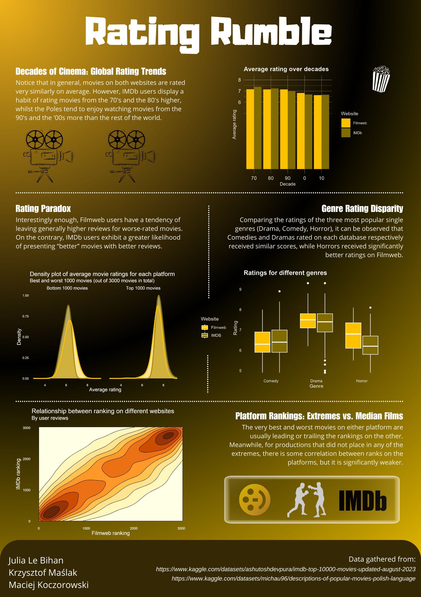

## Rating rumble 
#### Porównanie popularnych platform do oceniania filmów (IMDb oraz Filmweb)
Plakat skupia się na porównaniu rozkładów ocen pomiędzy powyższymi platformami i zbadaniu, w jaki sposób te rozkłady zależą na przykład od gatunku filmu. 
Okazało się bowiem, że pomimo pozornego podobieństwa użytkownicy obu platform wykazują różne cechy jeśli chodzi o ocenianie filmów. Ponadto sprawdziliśmy, 
czy pozycja w rankingu (najlepiej ocenianych filmów) na jednej platformie jest jakoś skorelowana z pozycją na drugiej. 

Autorzy: Julia Le Bihan, Krzysztof Maślak, Maciej Koczorowski.

Źródła danych:
* [Dane z serwisu IMDb](https://www.kaggle.com/datasets/ashutoshdevpura/imdb-top-10000-movies-updated-august-2023)
* [Dane z serwisu Filmweb](https://www.kaggle.com/datasets/michau96/descriptions-of-popular-movies-polish-language)

