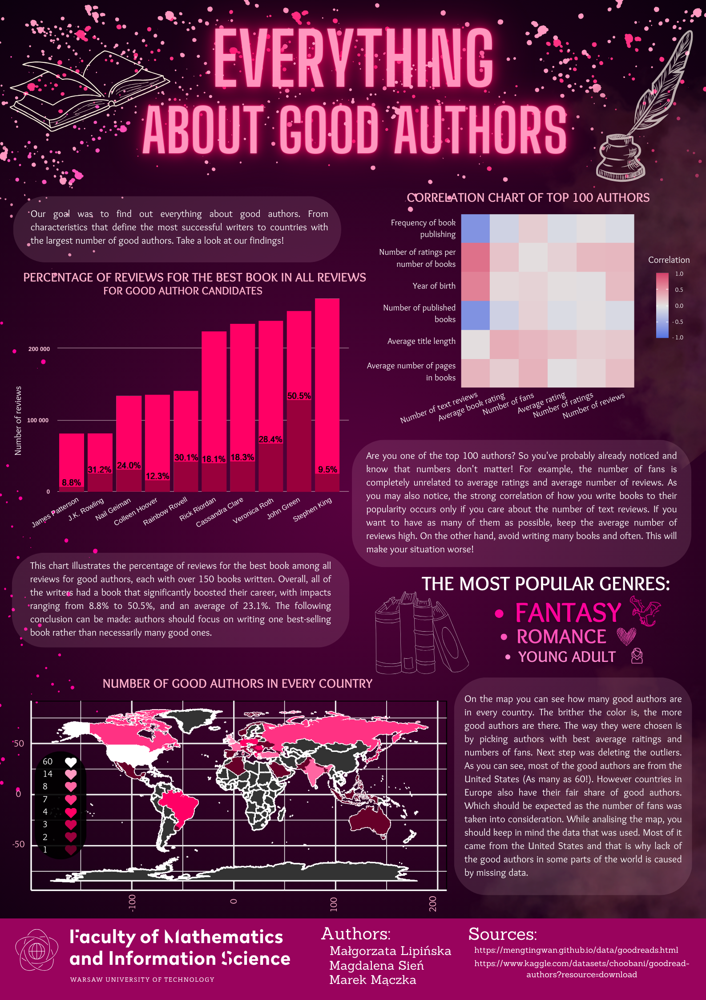

## Everything about good authors

Naszym celem było zebranie informacji o cechach dobrych autorów i przedstawienie ich na plakacie. Wykorzystaliśmy do tego zbiory danych ze strony "Goodreads". Nasz plakat został stworzony przy użyciu aplikacji "Canva", a wykresy na nim widniejące zostały przygotowane w języku "R".

Autorzy: Małgorzata Lipińska, Magdalena Sień, Marek Mączka

Źródła danych:
- [https://mengtingwan.github.io/data/goodreads.html](https://mengtingwan.github.io/data/goodreads.html)
- [https://www.kaggle.com/datasets/choobani/goodread-authors?resource=download](https://www.kaggle.com/datasets/choobani/goodread-authors?resource=download)

