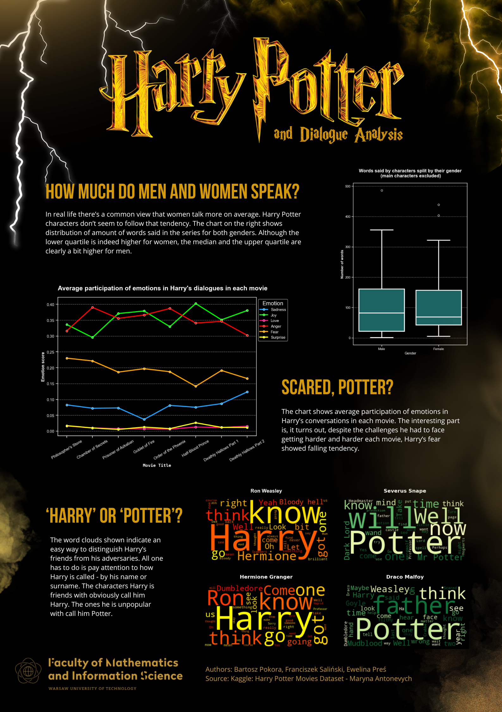

# Harry Potter and the Dialogue Analysis - poster

Project done by Ewelina Preś, Bartosz Pokora and Franciszek Saliński.

Sources:

- [Dataset from kaggle](https://www.kaggle.com/datasets/maricinnamon/harry-potter-movies-dataset)
- [Model used for sentiment analysis](https://huggingface.co/bhadresh-savani/bert-base-uncased-emotion)

Used technologies:

- Python 3.9.19
- pandas, numpy
- matplotlib, seaborn
- wordcloud
- transformers
- Canva

To recreate the results:

- Create Python 3.9.19 virtual environment
- Download the repository
- Head to directory `Pres_Pokora_Salinski/`
- Run the following command:

```bash
pip install -r requirements.txt
```

You should be able to run all the python scripts now.

## What we analyzed

In our project, after exploring the dataset, we decided to focus on a few things and visualize them. The charts we created are:

- Boxplot that shows the distribution of the number of words spoken by characters of each gender. We included only characters that said less than 500 words, in order to get rid of outliers, which are, in our case, main characters (most of them are men, so the boxplot could be misleading)
- Lineplot that visualizes how emotions of Harry Potter change throughout the movies
- Wordclouds that show the most frequently spoken words by specific characters in an interesting, eye-catching way

## Overview of the poster


