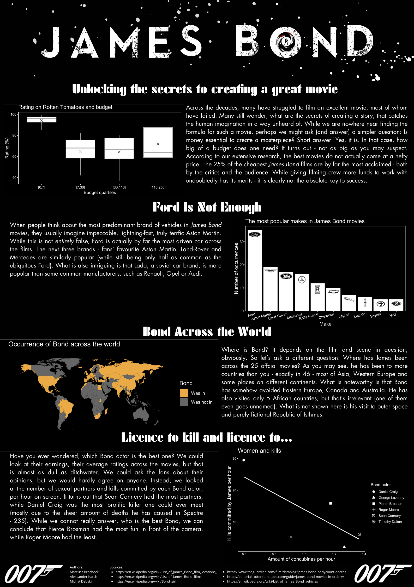

## James Bond 

Plakat dotyczący 25 filmów z serii James Bond. 
Przedstawione na nim są zarówno różne zależności między zdarzeniami w filmie, 
jak i te dotyczące technicznej części tworzenia filmu. 
Ponadto na plakacie można znaleźć statystyki dotyczące rozgrywania się akcji, 
a także najczęściej występujących marek aut w serii filmów.

Autorzy: Mateusz Brochocki, Michał Dębski, Aleksander Karch.

Źródła danych:
- https://en.wikipedia.org/wiki/List_of_James_Bond_film_locations 
- https://en.wikipedia.org/wiki/List_of_James_Bond_films
- https://en.wikipedia.org/wiki/Bond_girl
- https://www.theguardian.com/film/datablog/james-bond-bodycount-deaths
- https://editorial.rottentomatoes.com/guide/james-bond-movies-in-order/v
- https://en.wikipedia.org/wiki/List_of_James_Bond_vehicles

