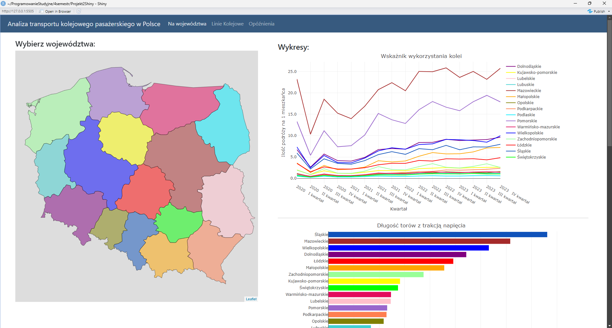
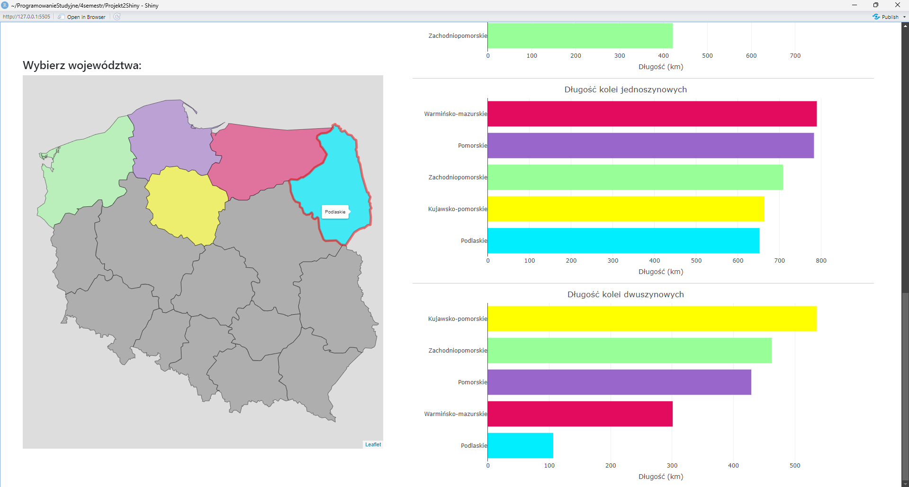
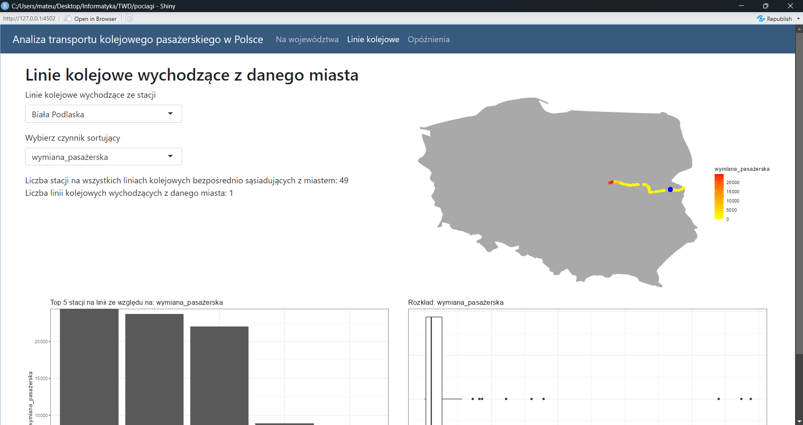
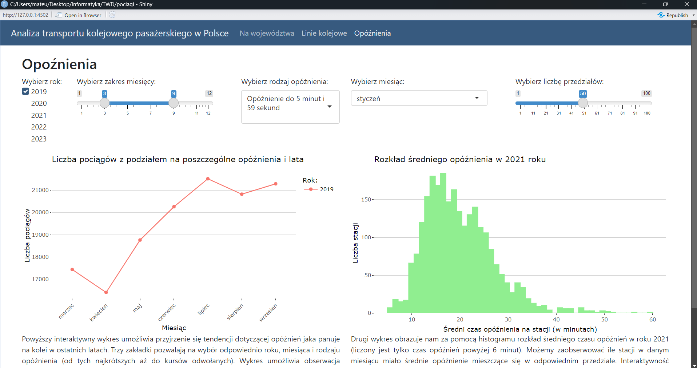

# Wizualizacja dotycząca transportu kolejowego pasażerskiego w Polsce

## Opis i screeny

Aplikacja podzielona jest na trzy zakładki. Pierwsza z nich opisuje sytuację kolei z podziałem na województwa. Druga odnosi się linii kolejowych, zaś trzecia do opóźnień. Każda z nich zawiera interaktywne wykresy umożliwiające pogłębioną eksplorację danych.

## Źródła

Dane czerpaliśmy ze strony Urzędu Transportu Kolejowego: https://dane.utk.gov.pl/