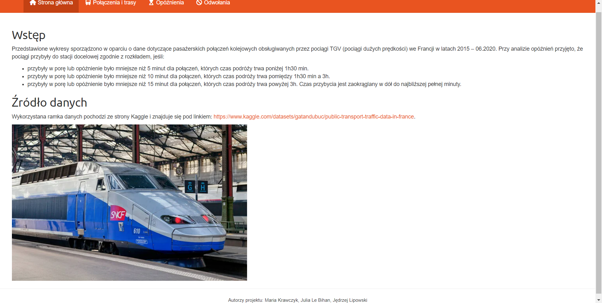
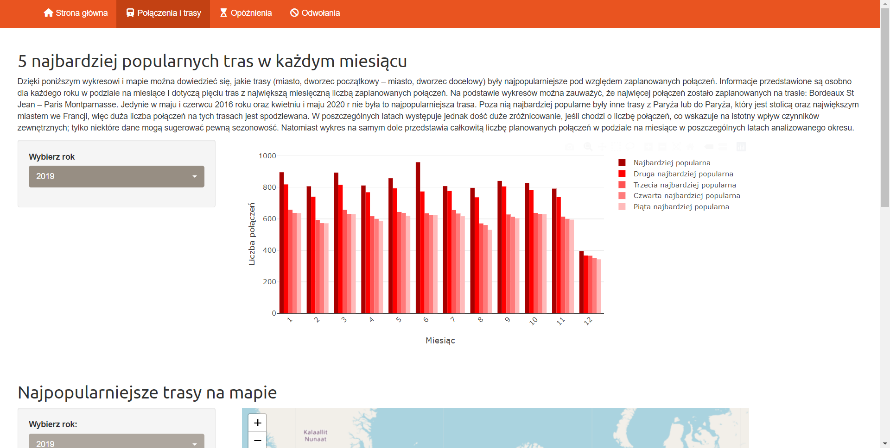
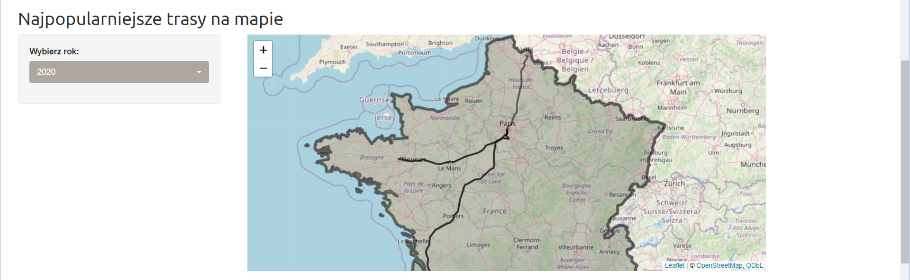
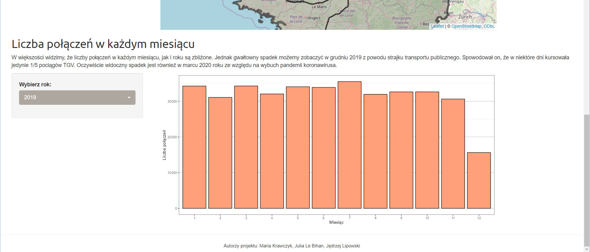
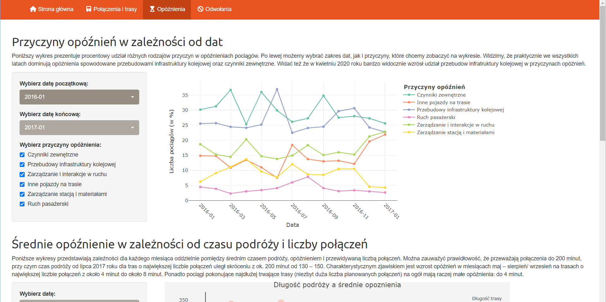
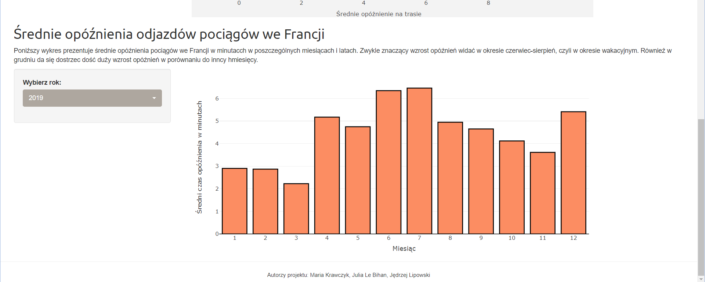
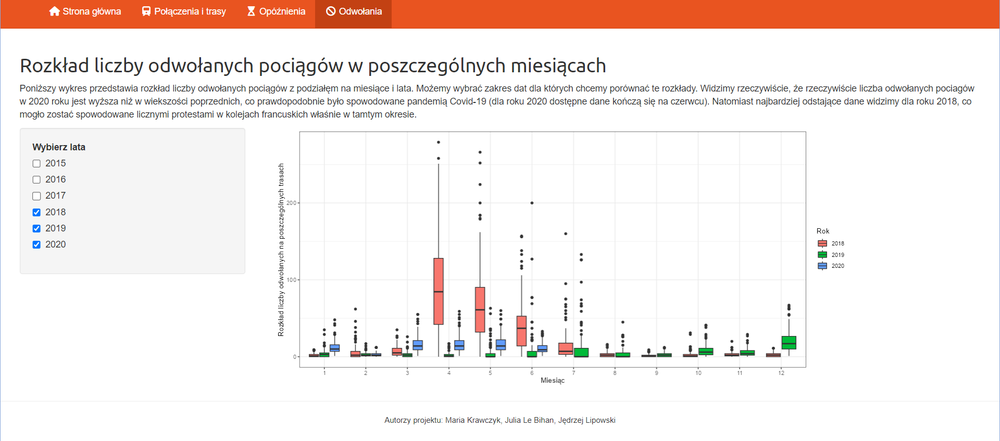

## Opis projektu

W ramach projektu stworzyliśmy interaktywny raport w Shiny na temat
francuskich kolei.

## Struktura raportu

Nasz raport składa się z czterech stron: - strony głównej, która zawiera
wstęp oraz źródło danych, z którego korzystaliśmy. - strony poświęconej
połączeniom i trasom pociągów. - strony zawierającej wykresy dotyczące
opóźnień francuskich pociągów. - strony z wykresem opisującym przyczyny
odwołań kursów pociągów.

## Poniżej znajdują się zrzuty ekranu naszego raportu

