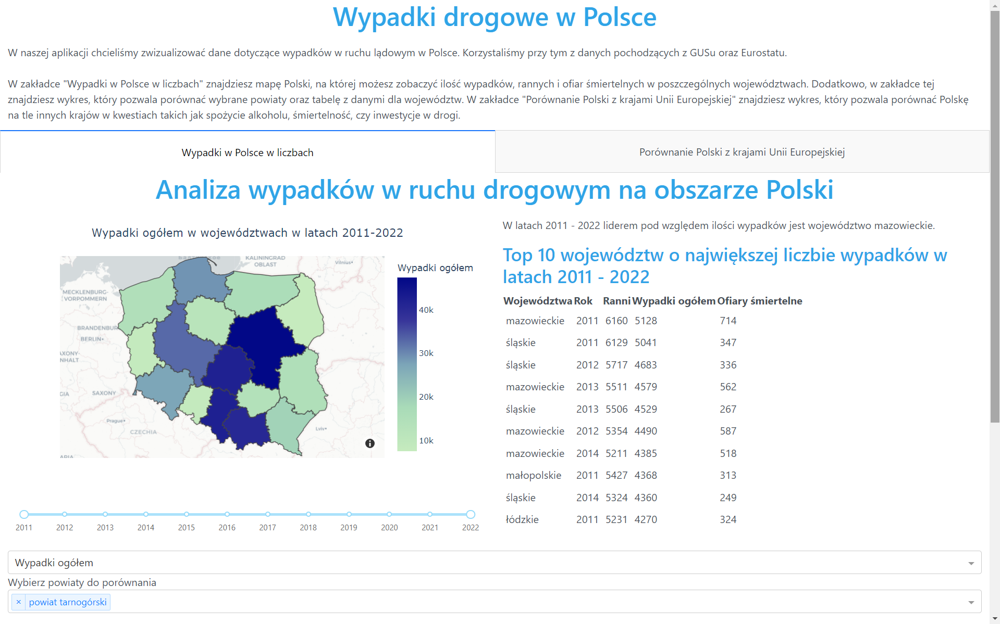
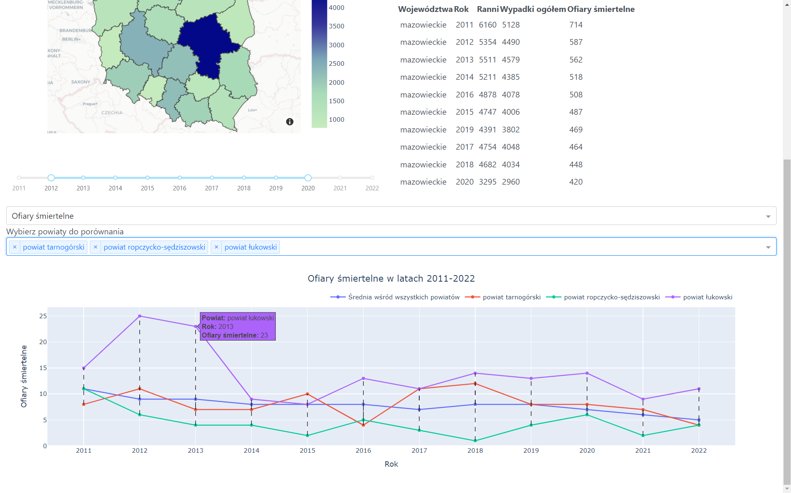
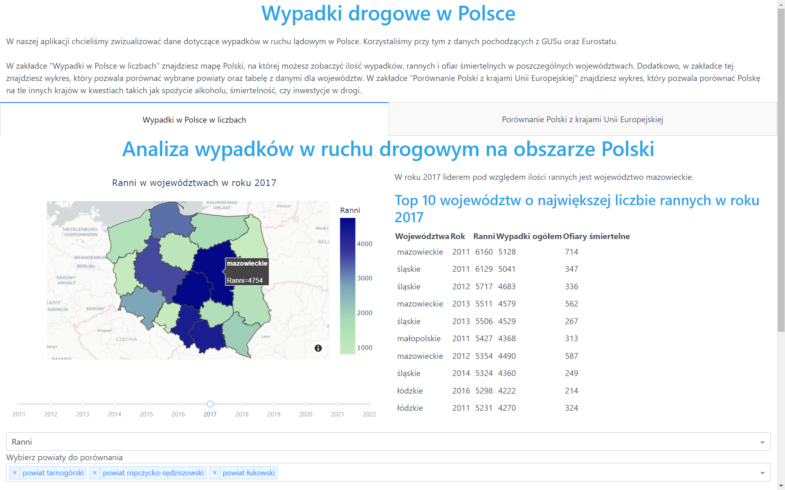
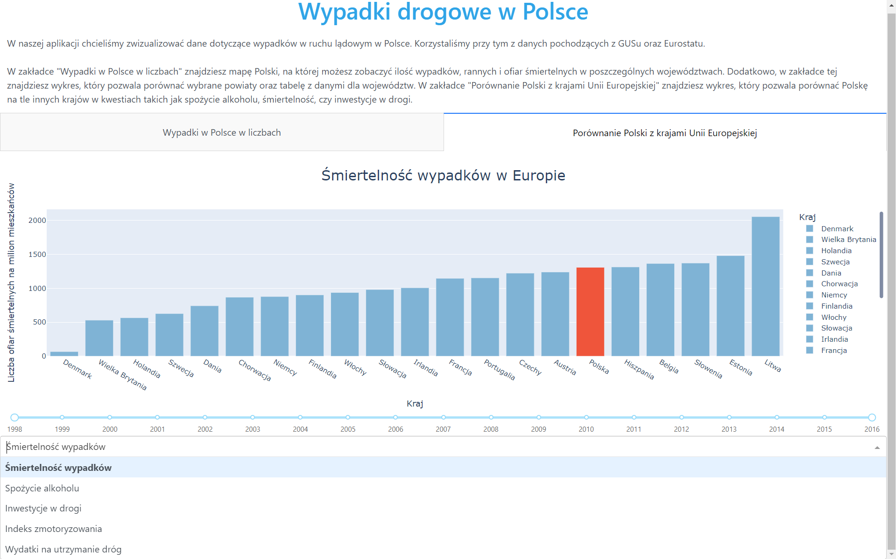
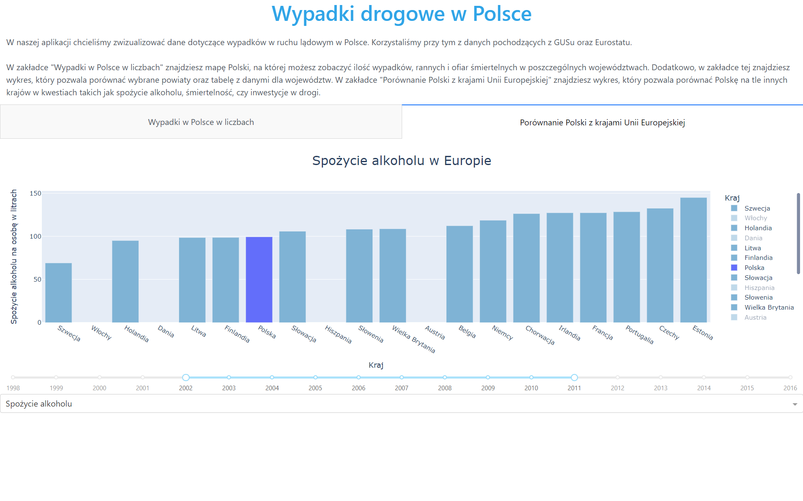

# Wypadki drogowe w Polsce

Autorzy: Krzysztof Krawiec, Bartosz Szymański, Franciszek Saliński

## Opis projektu

Stworzyliśmy aplikację, która wizualizuje i pozwala na analizę danych dotyczących wypadków drogowych w Polsce. Składa się ona z dwóch głownych części. Jedna z nich składa się z mapy oraz wykresów, które przedstawiają liczby wypadków i ofiar w poszczególnych województwach i powiatach. Druga część porównuje Polskę z innymi krajami UE pod względem między innymi śmiertelności wypadków, inwestycji w drogi oraz spożycia alkoholu.

Wygląd aplikacji:

