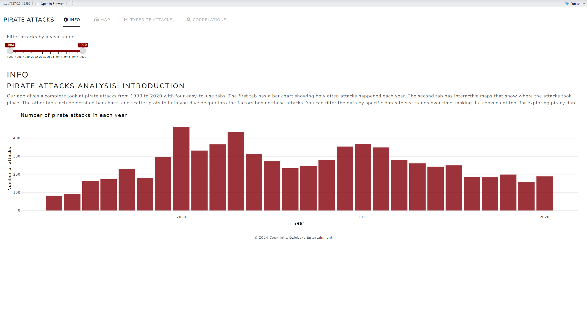
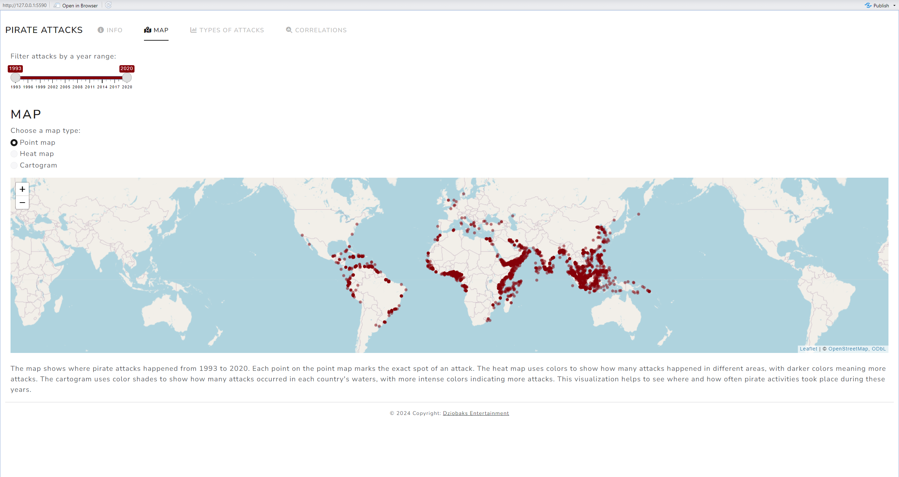
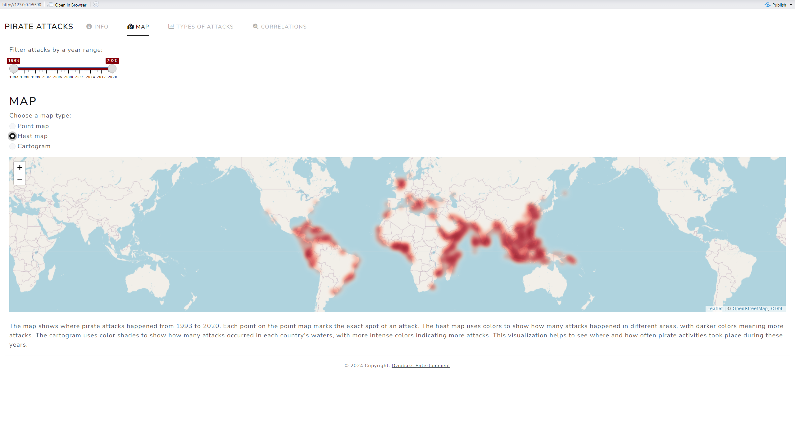
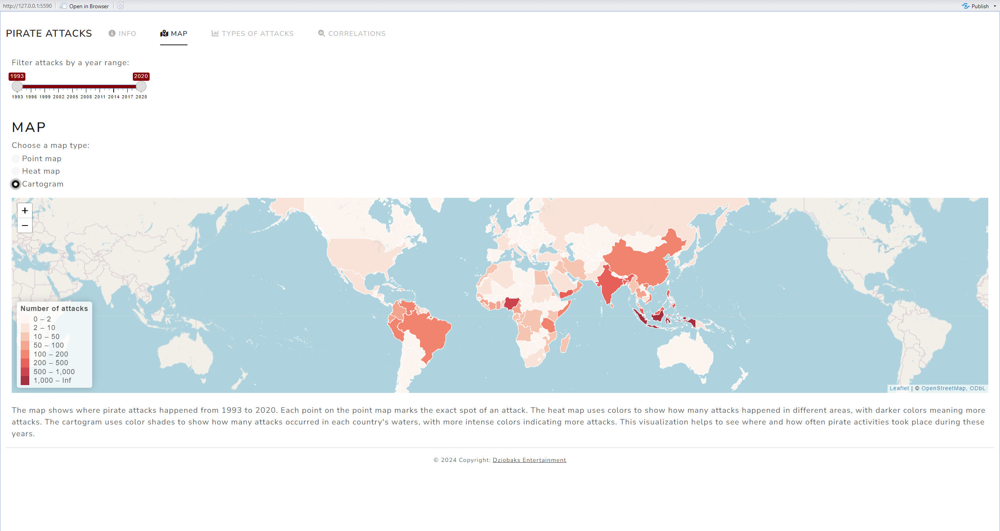
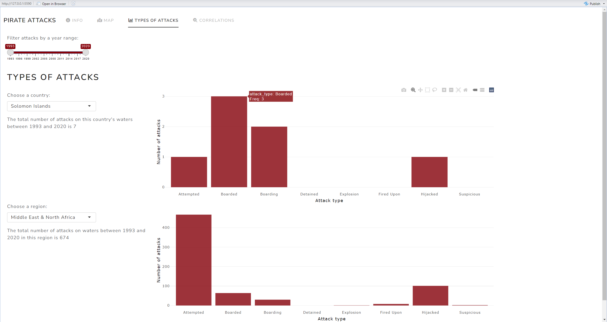

# Ataki piratów

## Bruno Podbielski, Bartosz Pokora, Mikołaj Ryll

## Wstęp

Aplikacja umożliwia wizualizację danych dotyczących ataków piratów w latach 1993 - 2020.

## Dane

Dane pochodzą z ramki danych, którą można znaleźć pod adresem: [https://www.kaggle.com/datasets/n0n5ense/global-maritime-pirate-attacks-19932020/data?select=pirate_attacks.csv&fbclid=IwAR0e1mZmSywGpLfejEThuaAwkKu2Nn9AsZIDASaf5WwsyC5vc15UQUh9ULU](https://www.kaggle.com/datasets/n0n5ense/global-maritime-pirate-attacks-19932020/data?select=pirate_attacks.csv&fbclid=IwAR0e1mZmSywGpLfejEThuaAwkKu2Nn9AsZIDASaf5WwsyC5vc15UQUh9ULU).

## Aplikacja

Poniższe screenshoty prezentują wygląd oraz działanie naszej aplikacji:

