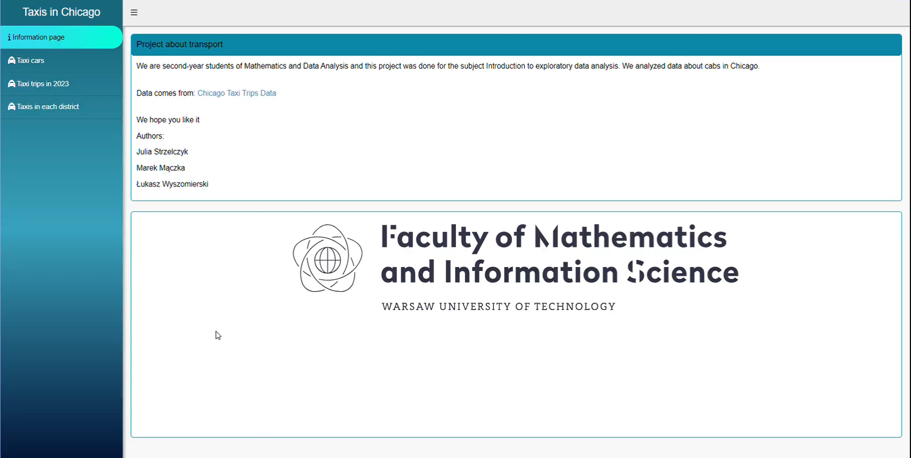
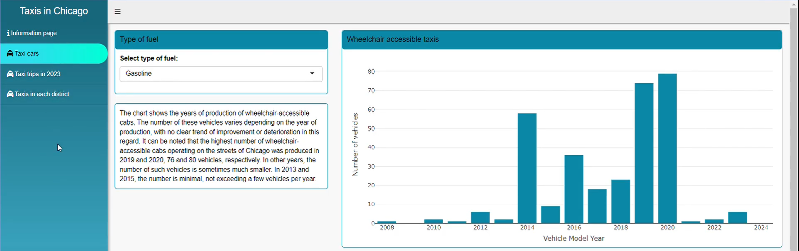
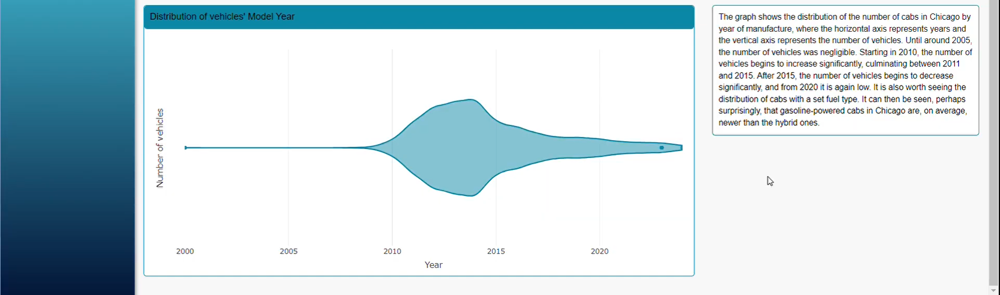
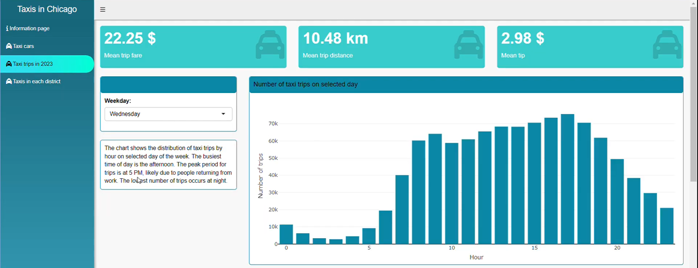
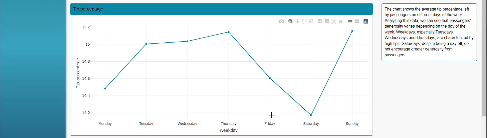
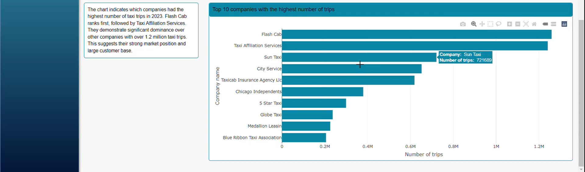
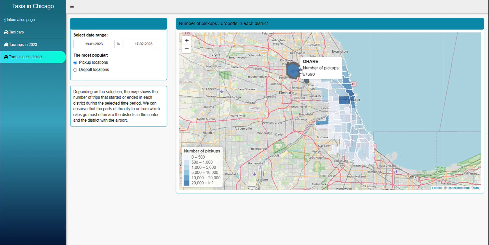

# Taxis in Chicago

Authors: Julia Strzelczyk, Marek Mączka, Łukasz Wyszomierski

## Project Descripion

We prepared on the project on the topic of "Transportation" an application in Shiny analyzing data on taxis in Chicago.
The app consists of 4 pages:
- `Informational page`
- `Taxi cars` 
A distribution of Vehicles Model Year and wheelchair accessibility taxis over the years. Everything with an option to select taxis with specified type of fuel.
- `Taxi trips in 2023`
It presents an analysis of rides in 2023. There are shown basic test statistics, the distribution of rides and the average percentage of tips grouped by a day of the week. There is also at the bottom of page a bar chart revealing the 10 companies with the highest number of trips.
- `Taxis in each discrict` 
On this page, you can see in which districts most of the trips started, or ended in a selected time interval.

Data comes from: [Chicago Data Portal](https://data.cityofchicago.org/Transportation/Taxi-Trips-2013-2023-/wrvz-psew/about_data)

## Project summary video

<video src="Strzelczyk_Maczka_Wyszomierski.mp4" controls title="Title"></video>

## App appearance:

