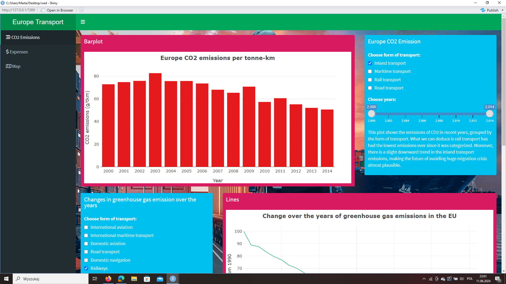
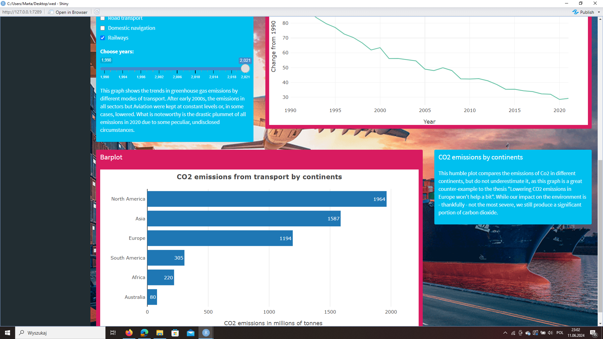
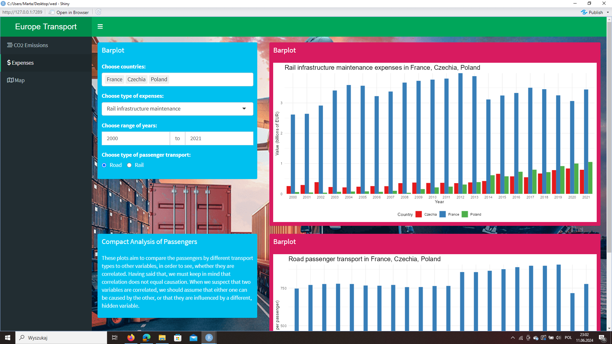
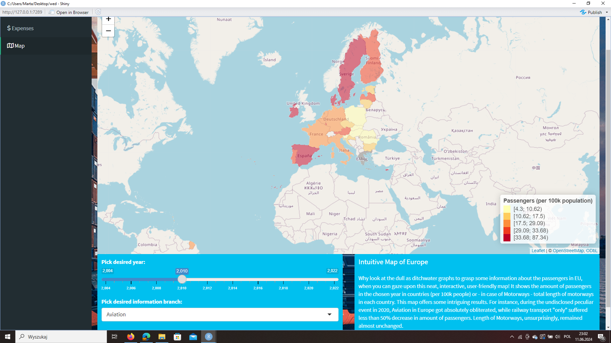

# Aplikacja zawiera wizualizacje dotyczące transportu w Unii Europejskiej.
## Marta Balcerzak, Aleksander Karch, Adrian Krzyżanowski
link do pobrania filmiku: https://mega.nz/file/Q5QCFL7T#4wSpoosX7qTEGdFP1Y8S7PN_rthV_uR-CKqywX4HipY
### Pierwsza zakładka jest poświęcona emisji CO2:

### Druga zakładka przedstawia wydatki na różne rodzaje transportu oraz ich popularność:

### Trzecia zakładka skupia się na popularności różnych środków transportu oraz długości autostrad w UE:

