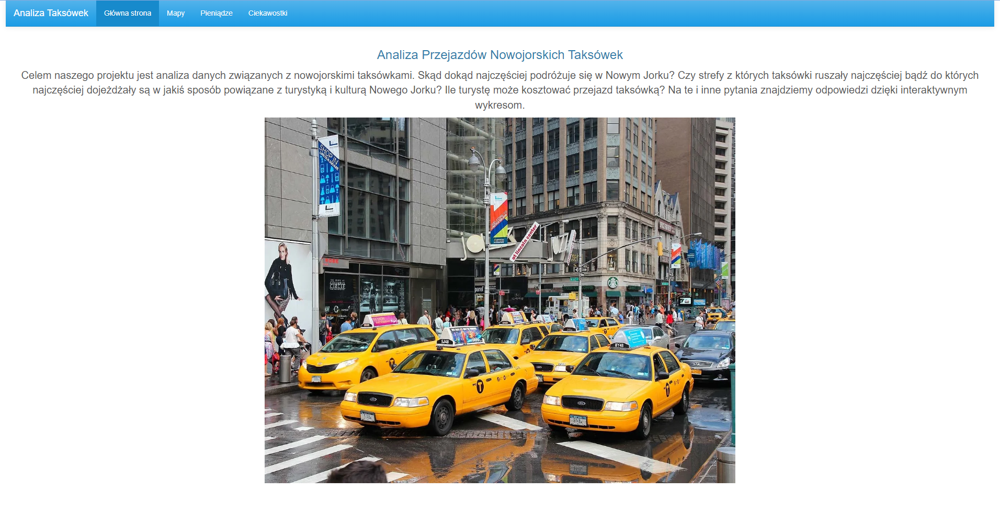
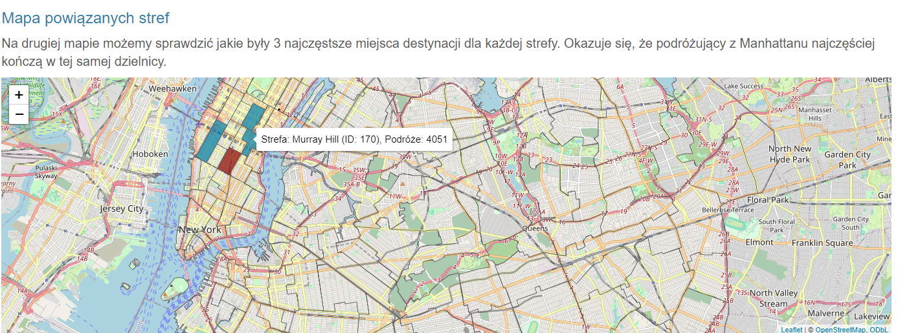
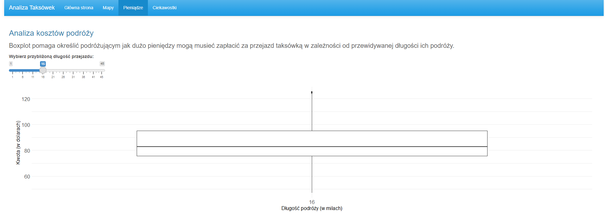
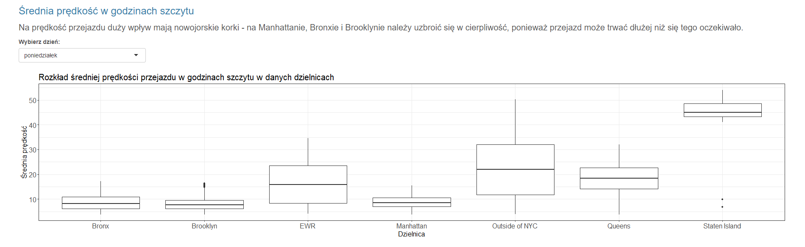
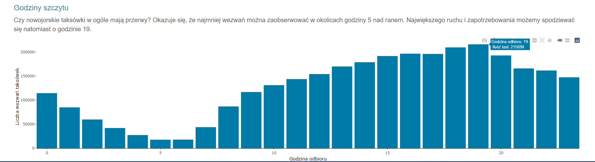

# Taksówki w Nowym Jorku

# Wstęp

Celem naszego projektu jest analiza danych związanych z nowojorskimi taksówkami. Skąd dokąd najczęściej podróżuje się w Nowym Jorku? Czy strefy z których taksówki ruszały najczęściej bądź do których najczęściej dojeżdżały są w jakiś sposób powiązane z turystyką i kulturą Nowego Jorku? Ile turystę może kosztować przejazd taksówką? Żeby odpowiedzieć na te i inne pytania przeanalizowaliśmy dane z poniższych źródeł:

1.  <https://www.nyc.gov/site/tlc/about/tlc-trip-record-data.page?fbclid=IwZXh0bgNhZW0CMTAAAR09XW2buW9-0_kKUOyqUQCkg_kbVa8CwkphDaB6-c70VX8Hu1iivscfg0w_aem_AV4FJg_eVcbKRTKcaJbe9FG5d2gnIJmnk09XLSkjvrSkqdDShfbNUdfMALCfsyJMslacFfNod62Hk38t3qjyb7Wu>

2.  <https://data.cityofnewyork.us/Transportation/NYC-Taxi-Zones/d3c5-ddgc?fbclid=IwZXh0bgNhZW0CMTAAAR0Wk5GWY3xlPtHD-tKEIJW3DVtfsL1yPqD-zTOuLgPmYGcnWrGsLgoV-d8_aem_ARaAogSaygIN3CNlqFrHEsgl-fWEnU3BJg59Is8FlhT5zCWRezRF6BJx4gVOV6z5YOxJ_KS1VlQcWWGQ3ibtCfKH>

# Opis strony

Nasza strona składa się ze strony tytułowej oraz 3 zakładki.

W pierwszej zakładce znajdują się mapy pokazujące częste destynacje, zarówno dla całego Nowego Jorku, jak i dla poszczególnych stref.

 

W drugeij zakładce zajmujemy się pieniędzmi.

 

Ostatnią zakładkę poświęciliśmy różnorakim ciekawostkom.

  

# Autorzy

-   Natalia Gajda

-   Jan Guttman

-   Paweł Kowalski
